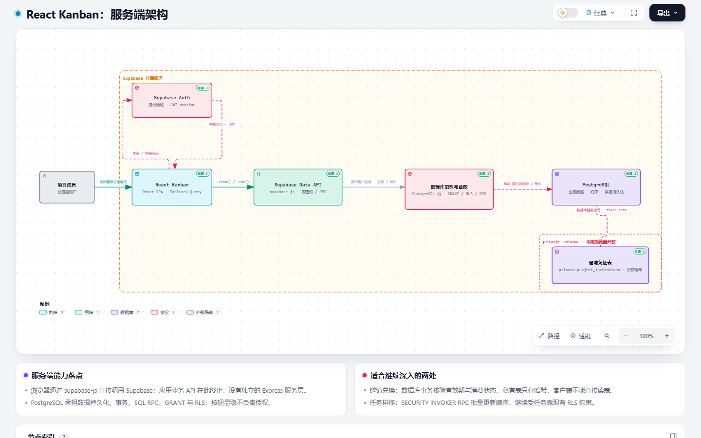

# React Kanban

一个基于 React、TypeScript 和 Supabase 的轻量级项目任务协作看板。用户可以创建项目，或通过邀请加入项目，再在看板中管理任务状态、优先级、负责人和评论。

## 在线体验

[打开任务协作看板](https://tasks-board-swart.vercel.app)

前端部署在 Vercel，认证和业务数据由 Supabase 提供。新用户可以通过邮箱注册；如果需要邮箱验证，请先完成邮件验证再登录。登录用户可以创建项目、查看自己创建或加入的项目；新成员通过项目邀请加入。任务和评论仅对项目成员开放。

## 系统架构



[交互式架构图 HTML 文件](docs/项目架构图.html)（下载后在浏览器中打开）。

## 功能

- 邮箱注册、登录和退出登录
- 创建项目、查看本人项目，并通过邀请加入其他项目
- 按待处理、进行中、已完成三个状态组织任务
- 创建、编辑、删除任务，调整状态和优先级
- 将项目成员设为任务负责人
- 按任务标题搜索，并按状态筛选
- 查看任务详情和评论、发表评论
- 设置个人显示名称
- 基于 Supabase Auth、Postgres 和 Row Level Security 控制访问
- 未配置 Supabase 时，可在开发环境查看演示入口；演示模式不保存任务数据

## 技术栈

| 分类 | 技术 |
| --- | --- |
| 前端 | React 19、TypeScript 6、Vite 8 |
| 路由与组件 | React Router 7、Ant Design 6、Ant Design Icons 6 |
| 状态与数据请求 | Zustand 5、TanStack Query 5 |
| 后端服务 | Supabase Auth、Postgres、Supabase JavaScript Client |
| 质量工具 | ESLint 10 |

## 环境要求

- Node.js：建议使用当前维护中的 LTS 版本
- npm：随 Node.js 一同安装
- Supabase 项目：启用邮箱认证，并应用本仓库提供的数据库迁移

## Vercel 部署

项目使用 Vite 构建为静态前端，构建命令为 `npm run build`，输出目录为 `dist`。根目录的 `vercel.json` 已配置 SPA 路由回退，支持直接打开或刷新看板地址。

在 Vercel 项目的 Environment Variables 中配置以下变量；修改变量后需要重新部署：

```dotenv
VITE_SUPABASE_URL=https://<project-ref>.supabase.co
VITE_SUPABASE_PUBLISHABLE_KEY=<your-supabase-publishable-key>
```

在 Supabase 的 Authentication → URL Configuration 中，将 Site URL 设置为正式站点地址，并把需要使用的生产或预览地址加入 Redirect URLs。前端只使用 Publishable/anon key；不要将 `service_role` 密钥放进前端环境变量。

## 本地运行

```bash
git clone <repository-url>
cd react-kanban
npm install
```

在项目根目录新建 `.env.local`，填入 Supabase 项目的连接信息：

```dotenv
VITE_SUPABASE_URL=https://<project-ref>.supabase.co
VITE_SUPABASE_PUBLISHABLE_KEY=<your-supabase-publishable-key>
```

这两个变量会被前端构建工具注入到浏览器端。只能使用 Supabase publishable/anon key；不要将 `service_role` 密钥或其他服务端密钥放入 `VITE_` 变量。

在 Supabase 项目中应用 `supabase/migrations/` 下的迁移。可以使用 Supabase CLI 将本地项目关联到 Supabase 项目后执行：

```bash
npx supabase login
npx supabase link --project-ref <project-ref>
npx supabase db push
```

也可以按文件名顺序在 Supabase SQL Editor 中执行迁移文件。部署前请确认迁移已全部应用，尤其是项目成员访问策略和 `create_project` 函数。

启动开发服务器：

```bash
npm run dev
```

Vite 会在终端显示本地访问地址。未配置 Supabase 时，开发环境显示演示入口；已配置时，用户需要注册或登录后访问项目功能。生产环境缺少 Supabase 配置时会显示配置错误提示。

## 常用命令

```bash
npm run dev       # 启动本地开发服务器
npm run build     # TypeScript 检查并构建生产版本
npm run preview   # 本地预览生产构建
npm run lint      # 运行 ESLint
```

## 页面路由

| 路径 | 说明 |
| --- | --- |
| `/invite` | 通过邀请链接加入项目 |
| `/projects` | 本人项目列表和创建项目 |
| `/projects/all` | 系统管理员查看全部项目 |
| `/projects/:projectRef/board` | 指定项目的任务协作看板；UUID 会压缩为 22 位 Base64URL 字符串 |

旧的完整 UUID 看板地址会重定向到压缩后的地址；上一版短路径 `/p/:projectId` 也会跳转到标准看板地址。根路径 `/` 会重定向到 `/projects`。部署到静态托管服务时，需要将未知前端路由回退到 `index.html`，以支持直接访问和刷新上述路径。

## 项目结构

```text
src/
├── app/                  # 路由入口和全局样式
├── features/
│   ├── auth/             # 登录、会话和个人资料
│   ├── projects/         # 项目页面、组件和数据访问
│   └── tasks/            # 看板页面、任务组件、数据访问、UI 状态和筛选
├── lib/                  # Supabase 客户端
supabase/
└── migrations/           # 数据库结构、访问策略和 RPC 迁移
docs/                     # 权限说明、路线图和开发记录
```

TanStack Query 管理服务端项目、任务、详情和评论数据；Zustand 保存看板搜索、状态筛选及当前选中的任务 ID；表单中的临时输入由组件本地状态管理。

## 数据与权限说明

- 项目、项目成员、任务、评论和个人资料保存在 Supabase 数据库中。
- 数据访问依赖 Supabase Auth 会话和数据库 Row Level Security 策略。请勿为了让界面可用而关闭 RLS。
- 当前用户只能访问其已加入项目中的任务及相关评论；可加入项目列表仅展示项目名称。
- 新建项目通过数据库 RPC 创建，并由迁移配置项目创建者和成员关系。
- 负责人关联 Supabase 用户账号，界面显示名称来自个人资料。

## 相关文档

- [项目架构图：服务端学习入口](docs/项目架构图.md)
- [Supabase 在本项目中的作用与对接说明](docs/Supabase在本项目中的作用与对接说明.md)
- [用户权限与数据访问](docs/用户权限与数据访问.md)
- [项目完整路线图](docs/项目完整路线图.md)
- [待完善功能与开发顺序](docs/待完善功能与开发顺序.md)
- [阶段进度速查](docs/阶段进度速查.md)

## 当前范围

项目聚焦于项目和任务协作的核心流程。邮件通知、附件、实时推送和审批式加入暂不属于当前范围；当前通过项目 owner/admin 发出的限时邀请链接加入。后续计划请以路线图和待完善功能文档为准。
