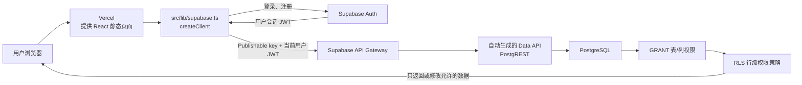

# Supabase 在本项目中的作用与对接说明

> 更新日期：2026-10-02。本文对应当前线上版本。前端地址：[tasks-board-swart.vercel.app](https://tasks-board-swart.vercel.app)。

## 1. 先用一句话理解

Supabase 是本项目的后端服务：托管 PostgreSQL 数据库、提供用户认证，并根据数据库表自动提供可调用的数据 API。我们自己设计了项目数据表、权限规则、数据库迁移和前端调用逻辑；Supabase 负责运行这些服务并在每次请求时执行相应认证和数据库规则。

Vercel 和 Supabase 分工不同：Vercel 发布 React 网页，Supabase 保存账号与项目数据并处理 API 请求。

## 2. 浏览器到数据库的连接流程



具体来说：

1. Vercel 提供已构建的网页。`VITE_SUPABASE_URL` 和 `VITE_SUPABASE_PUBLISHABLE_KEY` 由 Vercel 环境变量提供给 Vite 构建。
2. `src/lib/supabase.ts` 使用 `@supabase/supabase-js` 的 `createClient()` 建立浏览器客户端。
3. 用户在应用里注册或登录后，Supabase Auth 创建/校验用户，并颁发会话令牌。客户端将会话持久化、检测回跳 URL 并自动刷新令牌。
4. 应用调用 `supabase.from("tasks")`、`supabase.from("projects")` 等方法时，SDK 会向 Supabase 自动生成的 REST Data API 发 HTTPS 请求，不是让浏览器直接连接数据库端口。
5. Data API 把请求交给 PostgreSQL。数据库先检查角色拥有的表/列权限（`GRANT`），再执行 RLS 策略；通过的行才会返回或被修改。

Supabase Auth 使用 JWT；SDK 发起数据请求时会附带当前用户会话。Postgres 中的 `auth.uid()` 可用于判断发起请求的用户。登录和授权是两件事：登录证明账号是谁，RLS 决定这个账号能碰哪些项目数据。

## 3. Supabase 自动提供的部分（可以理解为托管黑盒）

| Supabase 负责运行的服务 | 在本项目里的作用 | 我们仍需决定或配置什么 |
| --- | --- | --- |
| 托管 PostgreSQL | 持久保存项目、成员、任务、评论和用户资料；负责数据库进程和底层基础设施运维。备份能力和保留时长取决于当前套餐，应在 Dashboard 核实。 | 自己定义表、字段、约束、索引、外键、默认值和迁移。 |
| Supabase Auth | 处理邮箱/密码注册与验证、登录校验、Auth 用户记录、密码安全存储、会话令牌签发与校验。 | 决定启用哪些登录方式及是否要求验证邮箱；前端仍需提供登录/注册页面并调用 Auth SDK。 |
| Auth 与会话客户端 | SDK 按客户端配置持久化会话、识别验证邮件回跳中的会话信息，并刷新令牌。当前代码显式启用了 `autoRefreshToken`、`persistSession`、`detectSessionInUrl`。 | 应用仍要在 `AuthGate` 中恢复登录状态、订阅认证状态变化、处理退出登录和错误反馈。 |
| PostgREST Data API | 从公开给 Data API 的 Postgres schema 自动生成 RESTful 数据访问接口；表和函数可通过 SDK 查询或调用。 | 自己写每个业务查询；配置 Data API 可访问的 schema、表/列授权和 RLS。自动生成接口不等于自动开放数据。 |
| Postgres 默认值与约束执行 | 插入行时执行表上已经定义的 UUID、时间、状态/优先级默认值、唯一性和外键约束。 | 默认值和约束是我们写在 SQL 迁移里的；Supabase 只在数据库写入时执行。 |

“黑盒”指我们不需要自己搭建 Auth 服务、数据库服务器和 CRUD HTTP 服务，不代表业务规则是 Supabase 自动猜出来的。数据模型和授权边界仍由本项目负责。

## 4. 本项目由我们手动编写或配置的部分

### 数据库表和业务规则

当前有效的数据模型只有：

| 表 | 保存内容 | 关键关系 |
| --- | --- | --- |
| `profiles` | 用户显示名称 | `id` 对应 Supabase Auth 用户 ID；个人资料行由应用在读取资料时补齐，不是数据库自动生成的个人资料表。 |
| `projects` | 项目名称和创建者 | 项目名按忽略大小写、去掉首尾空格后的值全局唯一。 |
| `project_members` | 哪些用户加入了哪个项目 | `(project_id, user_id)` 唯一；创建者建项目时会同时成为成员。 |
| `tasks` | 标题、状态、优先级、负责人、创建者 | 任务归属项目；负责人必须是同一项目的成员。 |
| `comments` | 评论内容、任务、作者和时间 | 评论归属任务；删除任务时由外键级联删除评论。 |

仓库的 `supabase/migrations/` 保存 SQL 变更历史。最初迁移曾包含团队表；后续迁移将现有数据迁移到直接项目成员模型并删除团队表。历史迁移按时间顺序保留，最终数据库状态才是当前模型。

### RLS 与表/列权限

RLS（Row Level Security，行级安全）是我们编写在 PostgreSQL 上的规则。Supabase 会在 Data API 请求到数据库时自动执行它们，但不会替我们决定规则内容。

当前边界概括如下：

- 未登录用户不能读写业务表。
- 登录用户可以浏览项目 ID/名称并自行加入项目；加入时 RLS 强制只能写入自己的用户 ID。
- 登录用户只能读取已加入项目的任务、评论和该项目成员资料。
- 项目创建者可通过数据库授权规则改名或删除自己的项目；当前页面不一定提供每一项管理操作。
- `GRANT` 决定角色能否访问表/列；RLS 决定它能访问哪些行，两者都要正确。

要注意：当前选择的是开放项目发现和自行加入。新注册用户也能看到项目名并自行加入。如果将来改成邀请或审批，需要一并调整 UI、RLS 和加入流程。

### 数据库函数与应用逻辑

- `create_project(text)` 是我们手动编写的 Postgres RPC：检查存在已登录用户，在一个数据库事务中创建项目并添加创建者为成员。它是 `SECURITY INVOKER`，因此调用者仍受 `GRANT` 和 RLS 约束。
- 加入项目不再依赖加入 RPC；前端插入自己的 `project_members` 行，由数据库 RLS 限制目标用户只能是当前用户。
- `src/features/auth/profileApi.ts` 在应用读取资料时按需补齐个人显示名称。Supabase 不会自动把注册表单里的名字同步到 `profiles`；注册名字先作为 Auth 用户 metadata 传入，然后本项目代码再写入资料表。
- TanStack Query 的查询、Mutation、缓存键及写入后刷新由本项目代码实现。项目没有订阅 Supabase Realtime；多个用户同时在线时，另一用户的更新要等页面重新请求/刷新后才能看到。

## 5. 环境与 Supabase 项目如何连起来

当前前端连接代码在 `src/lib/supabase.ts`，需要以下两个值：

```dotenv
VITE_SUPABASE_URL=https://<project-ref>.supabase.co
VITE_SUPABASE_PUBLISHABLE_KEY=<publishable-key>
```

- 本地开发：在根目录的 `.env.local` 放这两个值；该文件被 Git 忽略。
- 线上：在 Vercel 项目的 Environment Variables 中设置它们，修改后重新部署。
- Supabase Dashboard：维护邮箱登录/验证选项、正式 Site URL 和允许回跳的 Redirect URLs。仓库中的 `supabase/config.toml` 是 CLI 本地开发配置，不会自动修改托管 Supabase 项目的 Dashboard 配置。
- `Publishable key` 是设计给浏览器使用的项目公开标识。它本身不是数据权限边界，真正的数据保护来自 `GRANT`、RLS 和 Supabase Auth 会话。
- **不要**把 `service_role` 或 secret key 放进 `VITE_*` 环境变量、前端代码、Git 仓库或浏览器。服务端管理密钥可以绕过 RLS。

## 6. 对这个项目的优势

1. **少维护一层自建后端。** 目前以浏览器、Supabase Auth、自动 Data API 和 Postgres 完成核心流程，不需要另搭账号服务和基础 CRUD API。
2. **认证和数据库权限串得起来。** Auth 会话令牌随请求携带，PostgreSQL RLS 可以用当前用户身份限制项目数据。
3. **仍然使用完整 PostgreSQL。** 表结构、SQL、索引、约束和迁移都能审阅与版本管理，不被隐藏在只能点击的后台里。
4. **先小步上线，后续按需要扩展。** 文件、实时事件、服务端逻辑都可以逐项启用，不必为了未来可能用到的功能现在就搭建。
5. **托管职责清晰。** Vercel 负责前端发布，Supabase 负责 Auth 和业务数据；两边通过明确的 URL、公开 key、JWT 和 API 连接。

需要承担的对应责任是：认真维护 RLS、每次数据库改动保留迁移，并用不同权限的账号实际验证允许/拒绝的访问；公开 key 不能代替这些安全规则。

## 7. 目前没有使用、未来可按需加入的功能

| 功能 | 可用于什么 | 什么时候值得加入 | 当前状态 |
| --- | --- | --- | --- |
| Realtime | 任务或评论新增后通知其他浏览器重新加载；Presence 可显示谁在线。 | 用户明确需要“他人操作后不用手动刷新就看到变化”时。先为目标表配置变更发布与订阅，再处理断线、去重和缓存同步。 | 未接入；当前写操作后由 TanStack Query 刷新本地缓存。 |
| Storage | 上传并保存任务附件、头像等文件。 | 需要上传图片或文档时。需要创建 bucket、配置对象大小/类型规则和 Storage RLS；文件二进制不应直接塞进任务表。 | 未接入；当前没有附件功能。 |
| Edge Functions | 运行服务端 TypeScript；调用第三方服务、处理 webhook、保存服务端密钥、执行需受控的业务操作。 | 需要私密密钥、第三方 API 或服务端校验时。 | 未接入。`create_project(text)` 是数据库 RPC，不是 Edge Function。 |
| 自定义 SMTP | 为验证、重设密码等 Auth 邮件提供稳定发信服务，也可承载后续邮件通知。 | 开放更多用户注册或需要可靠投递时。Supabase 默认邮件服务有速率限制，正式用户量增长前应查看当前 Auth 邮件文档并配置自己的 SMTP。 | 用户已设置注册验证回跳；SMTP 是独立的投递配置，是否需要取决于实际邮件量和送达表现。 |
| Cron / 定时任务 | 定期执行提醒、过期任务检查或清理工作。 | 确实有定时处理需求且不适合由用户打开页面触发时。 | 未接入；首版任务清单不需要。 |

首版最值得考虑的扩展是 Realtime（如果手动刷新影响协作）和 Storage（如果确定要任务附件）。其他能力等实际需求出现再评估。

## 8. 相关代码与配置

| 路径 | 内容 |
| --- | --- |
| `src/lib/supabase.ts` | 读取 Vite 环境变量并建立客户端；启用会话持久化、自动刷新和 URL 会话检测。 |
| `src/features/auth/AuthPage.tsx` | 注册、登录表单；调用 Supabase Auth。 |
| `src/features/auth/AuthGate.tsx` | 恢复会话、订阅登录状态、控制登录后页面和退出。 |
| `src/features/auth/profileApi.ts` | 补齐、读取和修改应用自己的 `profiles` 记录。 |
| `src/features/projects/api/projectApi.ts` | 项目查询、加入、创建 RPC 和成员资料查询。 |
| `src/features/tasks/api/taskApi.ts` | 任务与评论的数据库 CRUD。 |
| `supabase/migrations/` | 表、默认值、外键、索引、RLS、GRANT 与 RPC 的数据库变更历史。 |
| `supabase/config.toml` | Supabase CLI 本地项目和开发 Auth URL 配置。 |
| `vercel.json` | Vite SPA 路由回退，让 React Router 路径可直接访问/刷新。 |
| `docs/用户权限与数据访问.md` | 当前 PostgreSQL 角色、表/列授权、RLS 查看位置和拟议应用角色。 |

## 9. 官方资料

- [Supabase 产品与数据库概览](https://supabase.com/docs/guides/database/overview)
- [Supabase Auth 概览](https://supabase.com/docs/guides/auth)
- [邮箱密码认证与验证邮件](https://supabase.com/docs/guides/auth/passwords)
- [Supabase 自动生成的 Data API](https://supabase.com/docs/guides/api)
- [PostgreSQL Row Level Security](https://supabase.com/docs/guides/database/postgres/row-level-security)
- [数据库迁移](https://supabase.com/docs/guides/deployment/database-migrations)
- [Supabase Realtime](https://supabase.com/docs/guides/realtime)
- [Supabase Storage](https://supabase.com/docs/guides/storage)
- [Supabase Edge Functions](https://supabase.com/docs/guides/functions)
