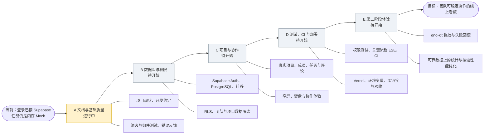

# 阶段进度速查

> 用于每次对话快速确认项目走到哪里。详细目标、验收标准、依赖原则和安全边界见《项目完整路线图》。进度按仓库实际状态更新，不因写入计划就标记为已完成。

## 当前状态

- **当前阶段**：阶段 A 已有基础实现，文档与质量基线待整理/持续验证。
- **下一项建议**：只读核对 Supabase 项目当前数据库状态，再单独确定最小数据模型。
- **当前核心限制**：登录接入 Supabase，但任务和评论仍来自内存 Mock；刷新会丢失任务变更。
- **外部待办**：SMTP 按当前决定暂缓；启用真实邀请邮件前需要单独配置并验收。

## 项目路线鱼骨图

主干表示推进顺序，分支表示各阶段主要交付。A 阶段正在整理基线；B–E 尚未开始。

## 阶段总览

| 顺序 | 阶段 | 主要技术栈/服务 | 主要功能或交付 | 当前进度 |
| --- | --- | --- | --- | --- |
| A | 文档与基础质量 | React、TypeScript、Ant Design、Vitest、Testing Library | 整理项目现状、任务流程反馈、基础测试与开发约定 | 部分已有；本路线文档刚建立，质量全量检查待按任务执行 |
| B | 数据库与权限 | Supabase Auth、PostgreSQL、RLS、Supabase CLI | 团队/成员/项目/任务/评论关系，迁移、权限验证、替换 Mock 数据 | 未开始；先只读检查 Supabase 项目 |
| C | 项目与协作 | Supabase SDK、TanStack Query、React Router、Ant Design | 真实项目列表、成员、指派、任务操作、评论、设置 | 未开始；依赖阶段 B 的 schema 和权限 |
| D | 测试、CI 与部署 | Vitest、Testing Library、评估 Playwright、CI、Vercel | 权限与关键流程测试、自动检查、生产环境发布和冒烟验收 | 未开始；SMTP 独立待配置 |
| E | 第二阶段体验 | 评估 `dnd-kit`、图表库；按需性能工具 | 拖拽排序、统计指标、数据增长后性能优化 | 未开始；不作为首版上线条件 |

## 阶段内任务顺序

### A · 文档与基础质量

1. 完成路线文档与本进度速查文档。
2. 每个后续任务按仓库现状确定范围、依赖、验收和 Git 检查点。
3. 根据变更运行相关测试；里程碑检查 `npm run test`、`npm run lint`、`npm run build`。

### B · 数据库与权限

1. Supabase 项目只读盘点：已有表、Auth 设置、迁移状态。
2. 定义并审阅最小数据模型、ER 图/数据关系和成员角色规则。
3. 使用 Supabase CLI 建迁移；逐表设置权限和 RLS。
4. 验证团队成员、管理员、非成员的读写边界。
5. 逐个用真实数据访问替换任务/评论 Mock，并验证刷新持久化与失败恢复。

### C · 项目与协作

1. 项目列表、创建项目、打开项目看板。
2. 项目成员与真实成员身份；任务负责人关联成员。
3. 真实任务 CRUD、状态/优先级、评论和删除确认。
4. 个人资料、退出登录、窄屏与键盘可用性。

### D · 测试、CI 与部署

1. RLS 正向/拒绝用例和关键数据访问测试。
2. 评估并按需增加 Playwright E2E；配置 lint、测试和 build 的 CI。
3. 配置预览/生产环境变量、Auth 回调和 Vercel SPA 深链接回退。
4. 预发布/生产冒烟：登录、项目隔离、任务流程、深链接刷新、越权拒绝。
5. SMTP 配置作为独立外部任务；完成前不验收邮件邀请。

### E · 第二阶段

1. 定义排序和跨列拖放规则，再评估 `dnd-kit`；验收键盘操作、失败回滚和服务端持久化。
2. 可靠任务数据与指标定义完成后，评估图表依赖并实现少量基础统计。
3. 根据真实数据量和测量结果再考虑分页、虚拟列表或分包。

## 单次对话任务记录

每轮只选一个能独立检查的任务。开始时从当前阶段选未完成项，并确认前置条件；结束时更新对应进度，记录验证结果、外部待办和建议 Git 检查点。Git 提交由项目维护者执行。

| 日期 | 阶段/任务 | 状态 | 验证/外部待办 | Git 检查点 |
| --- | --- | --- | --- | --- |
| 2026-09-30 | 创建项目路线与进度文档 | 已完成 | 仅创建 `docs/` 两份文档；本次未运行应用测试 | 待维护者检查并提交 |
