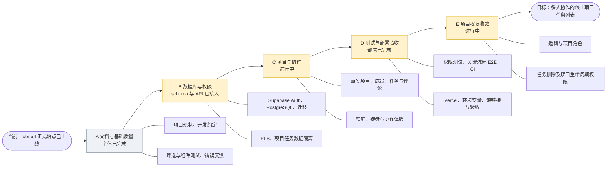

# 阶段进度速查

> 用于每次对话快速确认项目走到哪里。详细目标见《项目完整路线图》；权限边界见《用户权限与数据访问》；后续工作见《待完善功能与开发顺序》。进度按仓库实际状态和用户确认更新。

## 当前状态

- **当前阶段**：阶段 E 角色权限、邀请数据库与双模式前端均已提交至 `main` 并推送到 `origin/main`（HEAD `55599f1`）。两条邀请 migration 已应用；Vercel 是否已部署最新提交、浏览器中的邀请兑换是否可用，尚待验收。
- **线上地址**：[tasks-board-swart.vercel.app](https://tasks-board-swart.vercel.app)。用户确认站点已部署，邮箱验证配置应已连通正式域名。
- **下一项建议**：先在生产站点验收单人/多人邀请、登录后续接和“返回我的项目”；无需重跑已通过的 28 项本机数据库检查或 30 个前端测试。页面验收通过后，下一次编码做任务删除按钮权限及失败反馈。
- **当前核心限制**：最新前端生产部署及真实浏览器兑换尚未确认。普通成员仍看得到他人任务的删除按钮；管理员没有“全部项目”入口；跨账号任务变化需要手动刷新。组长成员管理与项目生命周期待开发，账号管理暂缓。
- **外部待办**：SMTP 按当前决定暂缓；泄露密码保护为可选安全增强（Supabase 官方说明仅 Pro 及以上计划提供）。

### 2026-10-04 维护者验收补充

- 已用管理员 A、项目 owner B、普通成员 C 完成四项页面权限测试，全部通过：创建/加入、成员仅删除本人任务、owner 删除成员任务、管理员未加入也能按链接管理任务。
- 详细证据与未覆盖范围见[权限验证记录](./权限验证记录.md)。本轮只整理维护者反馈，没有重跑远程或页面测试。
- 待办已记录：他人任务删除按钮仍可见、删除零行反馈需检查、管理员缺少全部项目入口、任务变化需要手动刷新。
- 开发顺序：邀请生产冒烟 → 任务删除权限界面 → 跨账号自动刷新 → 管理员全部项目列表 → 移除成员 → 转让 owner → 归档/恢复 → 永久删除 → 首版收尾。后续仅复核变更影响的权限场景，不重复整套已通过手动测试。

### 2026-10-04 本地邀请任务交付

> 首次交付时的历史记录；最新授权应用结果见下节及当前状态。

- 新 migration、本地邀请生成/复制、未登录续接、兑换和本人项目 owner 标签已实现；旧公开项目列表和自行加入 API 已移除。
- 数据库实际在隔离 PostgreSQL 17.6 中运行 20 项检查（含两个独立连接的并发、回滚与到期）；前端全套 8 文件/24 测试通过。远程只运行只读检查和 migration dry-run，新迁移尚未应用，前端未发布。
- 结构、数据权限变化、复跑方式和待执行的线上验收见[邀请加入项目实现与验证](./邀请加入项目实现与验证.md)。保留上轮未提交改动，停在 Git 检查点。

### 2026-10-04 邀请故障与双模式补充

- 应用前实际查询远程确认邀请 RPC 和表均不存在，解释 owner 加载失败；随后维护者明确授权，已应用两条邀请 migration，没有降低 RLS 或增加前端管理密钥。
- 新 migration 增加固定 1 小时多人模式，保留 24 小时单人及旧 RPC；看板增加返回 `/projects` 的按钮。
- 远程全部 13 个 migration 版本已对齐，六张现有业务/身份表完整行指纹未变；owner 旧单人/新多人生成、member 拒绝、管理员未加入访问等回滚检查通过。详细证据见[邀请双模式与故障修复](./邀请双模式与故障修复.md)。没有提交、推送或前端发布。

### 最新 Git 与下一步

- 上述邀请前端和数据库 migration 后续已合并并推送：`55599f1`，当前 `main` 与 `origin/main` 同步；本机工作区干净。
- 先由维护者在正式站点确认最新版本是否部署，并验收两种邀请和登录续接；不重做 Git 提交或数据库迁移。
- 验收通过后按独立 Git 检查点继续：任务删除按钮/失败反馈 → 跨账号自动刷新 → 管理员全部项目列表 → owner 成员管理和转让 → 归档/恢复 → 永久删除 → 首版验收。

## 项目路线鱼骨图

主干表示推进顺序，分支表示各阶段主要交付。B 阶段数据库 schema 与基础数据接入、C 阶段项目任务协作均已完成；D 阶段生产部署已完成；E 阶段权限收敛进行中。

## 阶段总览

| 顺序 | 阶段 | 主要技术栈/服务 | 主要功能或交付 | 当前进度 |
| --- | --- | --- | --- | --- |
| A | 文档与基础质量 | React、TypeScript、Ant Design、Vitest、Testing Library | 整理项目现状、任务流程反馈、基础测试与开发约定 | 部分已有；本路线文档刚建立，质量全量检查待按任务执行 |
| B | 数据库与权限 | Supabase Auth、PostgreSQL、RLS、Supabase CLI | 项目/成员/任务/评论关系，权限验证和数据持久化 | 远程 schema 已改为项目成员模型；数据访问已接入 |
| C | 项目与协作 | Supabase SDK、TanStack Query、React Router、Ant Design | 项目列表、加入项目、指派、任务操作、评论、设置 | 已实现；用户确认双账号访问与操作正常 |
| D | 测试、CI 与部署 | Vitest、Testing Library、评估 Playwright、CI、Vercel | 权限与关键流程检查、自动检查、生产发布和冒烟验收 | Vercel 已正式上线，邀请前端最新生产部署与真实页面兑换待验；CI 待做 |
| E | 项目权限收敛 | Supabase PostgreSQL、RLS、迁移、React | 邀请加入、项目角色、任务删除限制、成员管理、归档与删除 | 角色/邀请数据库及双模式代码已完成；生产页面验收待做；任务权限 UI、生命周期待做 |
| F | 第二阶段体验 | 按需评估拖拽/图表库与性能工具 | 拖拽排序、统计指标、数据增长后性能优化 | 未开始；不作为当前目标必需项 |

## 阶段内任务顺序

### A · 文档与基础质量

1. 完成路线文档与本进度速查文档。
2. 每个后续任务按仓库现状确定范围、依赖、验收和 Git 检查点。
3. 根据变更运行相关测试；里程碑检查 `npm run test`、`npm run lint`、`npm run build`。

### B · 数据库与权限

1. Supabase 项目只读盘点：已有表、Auth 设置、迁移状态。
2. 定义并审阅最小数据模型、ER 图/数据关系和成员角色规则。
3. 使用 Supabase CLI 建迁移；逐表设置权限和 RLS。
4. 验证项目成员、未加入用户和未登录用户的读写边界。
5. 逐个用真实数据访问替换任务/评论 Mock，并验证刷新持久化与失败恢复。

### C · 项目与协作

1. 项目列表、创建项目、打开项目看板。
2. 用户通过邀请加入项目（原公开加入已关闭）；任务负责人关联真实项目成员。
3. 真实任务 CRUD、状态/优先级、评论和删除确认。
4. 个人资料、退出登录、窄屏与键盘可用性。

### D · 测试、CI 与部署

1. RLS 正向/拒绝用例和关键数据访问测试。
2. 评估并按需增加 Playwright E2E；配置 lint、测试和 build 的 CI。
3. 预览/生产环境变量、Auth 回调和 Vercel SPA 深链接回退已由用户配置；生产站点已上线。
4. 双账号登录、加入项目、任务操作和刷新主流程已由用户确认；补验未加入账号的越权拒绝及邮箱验证邮件回跳。
5. SMTP 配置作为独立外部任务；完成前不验收邮件邀请。

### E · 项目权限收敛

1. **邀请数据库和双模式代码已完成，生产页面待验收**：owner/admin 生成固定 24 小时单人或 1 小时多人邀请；事务兑换加入 member；已关闭公开项目发现和自行加入。
2. 已完成：系统管理员登记与判断、项目 `owner/member` 角色回填/新建、管理员跨项目项目/任务策略、owner/管理员任务删除和普通成员删除限制。
3. 后续实现组长移除成员、转让 owner、归档/恢复/永久删除项目，并补充对应界面。
4. 本地项目列表已仅查询本人创建/加入项目，当前 `role=owner` 标记 `(owner)`，标签以实际角色为准。
5. 完成未加入账号、未登录用户等权限拒绝验收后，记录实际线上状态。

### F · 第二阶段体验

仅在出现真实需求后考虑拖拽排序、统计指标和性能优化。

## 单次对话任务记录

每轮只选一个能独立检查的任务。开始时从当前阶段选未完成项，并确认前置条件；结束时更新对应进度，记录验证结果、外部待办和建议 Git 检查点。Git 提交由项目维护者执行。

| 日期 | 阶段/任务 | 状态 | 验证/外部待办 | Git 检查点 |
| --- | --- | --- | --- | --- |
| 2026-09-30 | 创建项目路线与进度文档 | 已完成 | 仅创建 `docs/` 两份文档；本次未运行应用测试 | 待维护者检查并提交 |
| 2026-09-30 | Supabase MCP 盘点、CLI 配置与首个 schema 迁移 | 已完成（空表与策略已创建） | 项目 `kanban_board` 为 `ACTIVE_HEALTHY`、Postgres 17。Supabase MCP 已应用迁移 `20260930093203`；`profiles`、`teams`、`team_members`、`projects`、`project_members`、`tasks`、`comments` 均已创建并启用 RLS，当前没有业务数据。迁移逐表撤销远程默认 `anon` / `authenticated` / `PUBLIC` 权限，再授予应用所需权限；Dashboard 的暴露 schema 列表未通过电脑界面确认，但 Data API 已启用。CLI 2.118.0 已安装、初始化、登录并关联；本地迁移文件与远程版本一致。 | 待维护者检查并提交 |
| 2026-09-30 | Supabase 项目、任务与评论数据接入 | 已实现，用户确认流程及刷新持久化正常 | 项目页可查询/创建团队和项目；看板任务 CRUD、状态/优先级/项目成员指派与评论走 Supabase，Query key 按用户和项目隔离。 | 待维护者检查并提交 |
| 2026-09-30 | 修复创建团队的 RLS 拒绝 | 已完成，用户确认成功 | `create_team` 事务创建团队及初始管理员成员；后续迁移将 RPC 改为 `SECURITY INVOKER`，继续由 RLS 控制写入。 | 待维护者检查并提交 |
| 2026-09-30 | 修复创建项目的 RLS 拒绝及函数告警 | 已完成，用户确认团队/项目/任务创建成功 | `create_project` 事务校验团队管理员并创建项目成员；补充创建者读取策略，两个 RPC 改为 `SECURITY INVOKER`。修正 `team_id` 与冲突目标歧义。远程迁移 `20260930102533`、`20260930102815`、`20260930103555` 均已应用。 | 待维护者检查并提交 |
| 2026-09-30 | 检查 Supabase Security Advisor | 已完成 | `SECURITY DEFINER` 两条告警已消失；仅剩 Auth 泄露密码保护未启用，与团队/项目写入无关。 | 待维护者检查并提交 |
| 2026-09-30 | 看板项目名、负责人资料和重名项目处理 | 已实现，待页面确认 | 看板标题读取真实项目名称；负责人姓名存入 `profiles.display_name`，登录后补齐当前用户资料，并新增个人资料编辑页。远程有两个同团队同名项目：保留含 4 张卡片项目原名，将空项目改名为“原名 (2)”；新增忽略大小写与首尾空格的团队内唯一索引。迁移 `20260930110404` 已应用。 | 待维护者检查并提交 |
| 2026-09-30 | 修复 `profiles` 资料补齐权限冲突 | 代码已修正，待页面复核 | 远程仅授予 `UPDATE(display_name)`，而 PostgREST upsert 会尝试更新冲突键 `id`。改为缺行时 `INSERT`、空姓名时只 `UPDATE(display_name)`，不扩大主键权限。 | 待维护者检查并提交 |
| 2026-09-30 | 权限边界与待完善功能文档 | 已完成 | 新增《用户权限与数据访问》和《待完善功能与开发顺序》，包含当前 RLS/GRANT 矩阵、邀请边界、优先级与后续验收。 | 待维护者检查并提交 |
| 2026-09-30 | 用户主动加入项目 | 已实现，待双账号确认 | 新增 `list_joinable_projects` 与 `join_project` RPC；远程迁移 `20260930114302` 已应用。用户能选择项目加入，数据库事务同时写入普通团队成员及项目成员关系；仅对登录用户开放，项目和任务仍按成员权限隔离。Advisor 对两个受限 `SECURITY DEFINER` RPC 给出预期告警；还需双账号实测。 | 待维护者检查并提交 |
| 2026-09-30 | 移除团队层级、改为直接项目成员 | 已实现，待双账号页面复核 | 远程迁移 `20260930131433` 删除 `teams`/`team_members` 和团队外键；保留 2 个项目、2 条项目成员关系、4 条任务、1 条评论。项目名对登录用户可见，加入权限由项目成员表 RLS 控制；移除了导致 `project_id` 歧义的加入 RPC。`npm run build` 通过；测试套件未运行。 | 待维护者检查并提交 |
| 2026-09-30 | 双账号项目访问与操作确认 | 已完成，用户实测通过 | 用户确认第二个账号可正常访问项目并进行操作。未加入项目的权限拒绝用例、测试套件、CI 和 Vercel 部署仍待处理。 | 待维护者检查并提交 |
| 2026-10-01 | Vercel 生产部署与主流程验收 | 已完成，用户确认 | 正式地址为 `https://tasks-board-swart.vercel.app`；用户表示部署、环境配置、SPA 路由和主要验收任务已完成。邮箱验证跳转配置应已连通，建议抽查验证邮件最终回跳。 | README 与 `docs/` 已同步，待维护者检查并提交 |
| 2026-10-02 | 下一阶段权限需求确认与 Supabase 入门说明 | 需求已确认，尚未实现 | 目标为仅邀请加入、管理员跨项目管理项目/任务、组长管理成员和项目生命周期、成员不能删除他人任务；增加 Supabase、RLS 与 migration 阅读说明。此轮只更新文档，没有改前端权限或远程数据库。 | 待维护者检查并提交 |
| 2026-10-03 | 架构攻略审阅与轻量重构顺序 | 规划已记录，尚未实现 | 项目 API 已按 auth/projects/tasks feature 划分；整理建议聚焦 `App.tsx` 页面拆分和 Query hooks，不引入不必要的 HTTP、Repository 或自建服务端层。本轮仅更新规划文档。 | 待维护者检查并提交 |
| 2026-10-03 | 项目角色基础与任务删除权限 | 已实现并应用远程 migration | 新增 `owner/member`、安全回填创建者、私有系统管理员表及 RLS。远程回滚事务验证：新加入默认为 member；普通成员删本人任务成功、删他人任务拒绝；owner 可删成员任务；临时管理员可跨项目管理项目和任务。公开发现/自行加入仍开放，下一项必须做邀请并关闭。`supabase migration list --linked` 显示本地与远程版本一致。 | 待维护者 review 后单独提交本任务文件 |
| 2026-10-04 | 三账号页面权限验收与后续排期 | 维护者手动测试四项通过 | A/B/C 的创建、加入、任务删除和管理员未入项目访问均已确认；按钮权限、管理员列表、协作刷新记入待办。本轮只更新文档。 | 进度文档由维护者检查并提交 |
| 2026-10-04 | 仅邀请加入、关闭公开发现/自行加入 | 本地实现与检查完成，未应用远程/未发布前端 | 隔离 PostgreSQL 20 项运行检查、Vitest 24 测试通过；已执行远程只读检查和 CLI dry-run；真实 Supabase 页面与 API 邀请验收尚未执行。 | 建议先提交上轮角色任务，再单独提交本轮增量；未暂存/提交/推送/部署 |
| 2026-10-04 | 邀请双模式与数据库授权应用 | 已提交推送；生产页面验收待做 | `55599f1` 已在 `main`/`origin/main`；迁移版本一致，数据指纹及远程角色回滚检查通过；本机 28 项数据库检查、30 个前端测试通过。真实浏览器兑换及 Vercel 自动部署状态待确认 | Git 检查点完成；下一步线上冒烟 |
