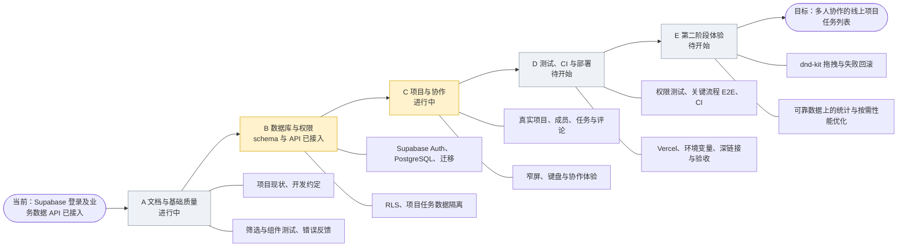

# 阶段进度速查

> 用于每次对话快速确认项目走到哪里。详细目标见《项目完整路线图》；权限边界见《用户权限与数据访问》；后续工作见《待完善功能与开发顺序》。进度按仓库实际状态更新，不因写入计划就标记为已完成。

## 当前状态

- **当前阶段**：阶段 C 已实现核心项目/任务流程，阶段 D 上线准备待做。远程 schema 已简化为用户资料、项目、项目成员、任务和评论。
- **下一项建议**：配置 Vercel 预览环境并验收上线流程；同时验证未加入项目的账号无法读取任务、评论和成员资料。
- **当前核心限制**：项目名对登录用户可见，项目任务按成员隔离。团队和团队成员数据结构已删除；用户已确认第二个账号能够正常访问项目并参与操作。生产构建和 lint 已通过；测试套件、权限拒绝用例、CI 和正式部署尚未验收。
- **外部待办**：SMTP 按当前决定暂缓；泄露密码保护为可选安全增强（Supabase 官方说明仅 Pro 及以上计划提供）。

## 项目路线鱼骨图

主干表示推进顺序，分支表示各阶段主要交付。B 阶段数据库 schema 与基础数据接入已完成；C 阶段项目、任务与评论接入进行中；D–E 尚未开始。

## 阶段总览

| 顺序 | 阶段 | 主要技术栈/服务 | 主要功能或交付 | 当前进度 |
| --- | --- | --- | --- | --- |
| A | 文档与基础质量 | React、TypeScript、Ant Design、Vitest、Testing Library | 整理项目现状、任务流程反馈、基础测试与开发约定 | 部分已有；本路线文档刚建立，质量全量检查待按任务执行 |
| B | 数据库与权限 | Supabase Auth、PostgreSQL、RLS、Supabase CLI | 项目/成员/任务/评论关系，权限验证和数据持久化 | 远程 schema 已改为项目成员模型；数据访问已接入 |
| C | 项目与协作 | Supabase SDK、TanStack Query、React Router、Ant Design | 项目列表、加入项目、指派、任务操作、评论、设置 | 已实现；用户确认双账号访问与操作正常 |
| D | 测试、CI 与部署 | Vitest、Testing Library、评估 Playwright、CI、Vercel | 权限与关键流程测试、自动检查、生产环境发布和冒烟验收 | 进行中；双账号主流程已确认，权限拒绝用例及部署待做 |
| E | 第二阶段体验 | 评估 `dnd-kit`、图表库；按需性能工具 | 拖拽排序、统计指标、数据增长后性能优化 | 未开始；不作为首版上线条件 |

## 阶段内任务顺序

### A · 文档与基础质量

1. 完成路线文档与本进度速查文档。
2. 每个后续任务按仓库现状确定范围、依赖、验收和 Git 检查点。
3. 根据变更运行相关测试；里程碑检查 `npm run test`、`npm run lint`、`npm run build`。

### B · 数据库与权限

1. Supabase 项目只读盘点：已有表、Auth 设置、迁移状态。
2. 定义并审阅最小数据模型、ER 图/数据关系和成员角色规则。
3. 使用 Supabase CLI 建迁移；逐表设置权限和 RLS。
4. 验证项目成员、未加入用户和未登录用户的读写边界。
5. 逐个用真实数据访问替换任务/评论 Mock，并验证刷新持久化与失败恢复。

### C · 项目与协作

1. 项目列表、创建项目、打开项目看板。
2. 用户主动加入项目；任务负责人关联真实项目成员。
3. 真实任务 CRUD、状态/优先级、评论和删除确认。
4. 个人资料、退出登录、窄屏与键盘可用性。

### D · 测试、CI 与部署

1. RLS 正向/拒绝用例和关键数据访问测试。
2. 评估并按需增加 Playwright E2E；配置 lint、测试和 build 的 CI。
3. 配置预览/生产环境变量、Auth 回调和 Vercel SPA 深链接回退。
4. 预发布/生产冒烟：登录、项目隔离、任务流程、深链接刷新、越权拒绝。
5. SMTP 配置作为独立外部任务；完成前不验收邮件邀请。

### E · 第二阶段

1. 定义排序和跨列拖放规则，再评估 `dnd-kit`；验收键盘操作、失败回滚和服务端持久化。
2. 可靠任务数据与指标定义完成后，评估图表依赖并实现少量基础统计。
3. 根据真实数据量和测量结果再考虑分页、虚拟列表或分包。

## 单次对话任务记录

每轮只选一个能独立检查的任务。开始时从当前阶段选未完成项，并确认前置条件；结束时更新对应进度，记录验证结果、外部待办和建议 Git 检查点。Git 提交由项目维护者执行。

| 日期 | 阶段/任务 | 状态 | 验证/外部待办 | Git 检查点 |
| --- | --- | --- | --- | --- |
| 2026-09-30 | 创建项目路线与进度文档 | 已完成 | 仅创建 `docs/` 两份文档；本次未运行应用测试 | 待维护者检查并提交 |
| 2026-09-30 | Supabase MCP 盘点、CLI 配置与首个 schema 迁移 | 已完成（空表与策略已创建） | 项目 `kanban_board` 为 `ACTIVE_HEALTHY`、Postgres 17。Supabase MCP 已应用迁移 `20260930093203`；`profiles`、`teams`、`team_members`、`projects`、`project_members`、`tasks`、`comments` 均已创建并启用 RLS，当前没有业务数据。迁移逐表撤销远程默认 `anon` / `authenticated` / `PUBLIC` 权限，再授予应用所需权限；Dashboard 的暴露 schema 列表未通过电脑界面确认，但 Data API 已启用。CLI 2.118.0 已安装、初始化、登录并关联；本地迁移文件与远程版本一致。 | 待维护者检查并提交 |
| 2026-09-30 | Supabase 项目、任务与评论数据接入 | 已实现，用户确认流程及刷新持久化正常 | 项目页可查询/创建团队和项目；看板任务 CRUD、状态/优先级/项目成员指派与评论走 Supabase，Query key 按用户和项目隔离。 | 待维护者检查并提交 |
| 2026-09-30 | 修复创建团队的 RLS 拒绝 | 已完成，用户确认成功 | `create_team` 事务创建团队及初始管理员成员；后续迁移将 RPC 改为 `SECURITY INVOKER`，继续由 RLS 控制写入。 | 待维护者检查并提交 |
| 2026-09-30 | 修复创建项目的 RLS 拒绝及函数告警 | 已完成，用户确认团队/项目/任务创建成功 | `create_project` 事务校验团队管理员并创建项目成员；补充创建者读取策略，两个 RPC 改为 `SECURITY INVOKER`。修正 `team_id` 与冲突目标歧义。远程迁移 `20260930102533`、`20260930102815`、`20260930103555` 均已应用。 | 待维护者检查并提交 |
| 2026-09-30 | 检查 Supabase Security Advisor | 已完成 | `SECURITY DEFINER` 两条告警已消失；仅剩 Auth 泄露密码保护未启用，与团队/项目写入无关。 | 待维护者检查并提交 |
| 2026-09-30 | 看板项目名、负责人资料和重名项目处理 | 已实现，待页面确认 | 看板标题读取真实项目名称；负责人姓名存入 `profiles.display_name`，登录后补齐当前用户资料，并新增个人资料编辑页。远程有两个同团队同名项目：保留含 4 张卡片项目原名，将空项目改名为“原名 (2)”；新增忽略大小写与首尾空格的团队内唯一索引。迁移 `20260930110404` 已应用。 | 待维护者检查并提交 |
| 2026-09-30 | 修复 `profiles` 资料补齐权限冲突 | 代码已修正，待页面复核 | 远程仅授予 `UPDATE(display_name)`，而 PostgREST upsert 会尝试更新冲突键 `id`。改为缺行时 `INSERT`、空姓名时只 `UPDATE(display_name)`，不扩大主键权限。 | 待维护者检查并提交 |
| 2026-09-30 | 权限边界与待完善功能文档 | 已完成 | 新增《用户权限与数据访问》和《待完善功能与开发顺序》，包含当前 RLS/GRANT 矩阵、邀请边界、优先级与后续验收。 | 待维护者检查并提交 |
| 2026-09-30 | 用户主动加入项目 | 已实现，待双账号确认 | 新增 `list_joinable_projects` 与 `join_project` RPC；远程迁移 `20260930114302` 已应用。用户能选择项目加入，数据库事务同时写入普通团队成员及项目成员关系；仅对登录用户开放，项目和任务仍按成员权限隔离。Advisor 对两个受限 `SECURITY DEFINER` RPC 给出预期告警；还需双账号实测。 | 待维护者检查并提交 |
| 2026-09-30 | 移除团队层级、改为直接项目成员 | 已实现，待双账号页面复核 | 远程迁移 `20260930131433` 删除 `teams`/`team_members` 和团队外键；保留 2 个项目、2 条项目成员关系、4 条任务、1 条评论。项目名对登录用户可见，加入权限由项目成员表 RLS 控制；移除了导致 `project_id` 歧义的加入 RPC。`npm run build` 通过；测试套件未运行。 | 待维护者检查并提交 |
| 2026-09-30 | 双账号项目访问与操作确认 | 已完成，用户实测通过 | 用户确认第二个账号可正常访问项目并进行操作。未加入项目的权限拒绝用例、测试套件、CI 和 Vercel 部署仍待处理。 | 待维护者检查并提交 |
