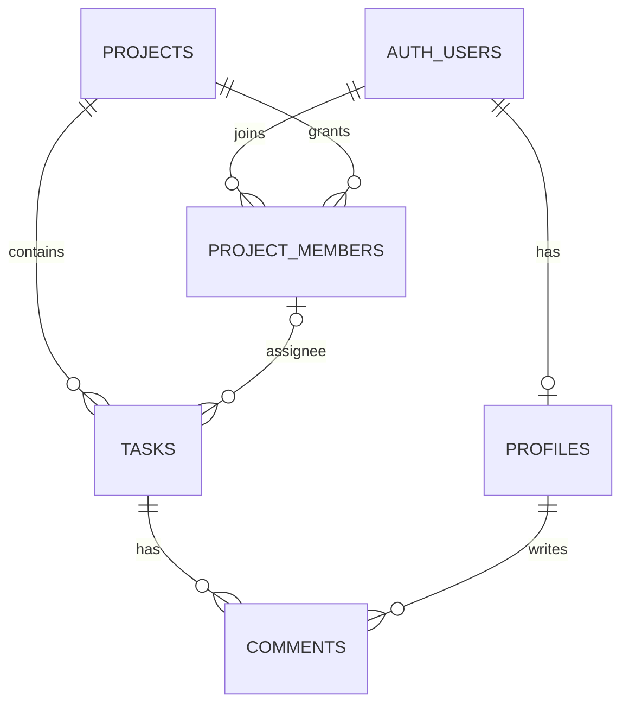

# 项目完整路线图

> 目标是多人协作的项目任务列表。当前只管理项目、项目成员、任务和评论；不设置团队层级。

## 1. 首版范围

- 用户注册、登录、维护个人显示名称。
- 登录用户可以创建项目、浏览项目名称并主动加入。
- 项目成员共同维护任务：创建、编辑、指派、修改状态/优先级、删除和评论。
- 任务和评论仅对该项目成员开放，数据刷新后仍然保留。
- 当前不做团队管理、邀请审批、邮件邀请、实时推送、拖拽和统计。
- Supabase 提供 Auth 与 PostgreSQL；Vercel 托管 Vite 前端。

## 2. 当前实现状态（2026-09-30）

- React、TypeScript、Ant Design、React Router、TanStack Query 和 Zustand 已接入。
- Supabase Auth、项目、项目成员、任务、评论和个人资料 API 已接入。
- 项目创建者自动成为项目成员；任何已登录用户可浏览项目 ID/名称并为自己加入项目。
- 看板提供任务 CRUD、状态/优先级、项目成员指派和评论。
- 项目成员关系已改为直接关联项目。远程迁移移除了团队表和团队外键，并保留现有数据：2 个项目、2 条项目成员关系、4 条任务、1 条评论。
- 用户已确认第二个账号能够正常访问项目并参与操作。生产构建和 lint 已通过；未加入项目的权限拒绝用例、测试套件、CI、Vercel 部署和预发布验收仍待完成。

## 3. 数据与权限

- `profiles` 存用户显示名称；本人可以更新。
- `projects` 存项目名称和创建者；项目名称忽略大小写和首尾空格后全局唯一。
- `project_members` 以 `(project_id, user_id)` 建立成员关系；登录用户只能为自己加入。
- `tasks` 通过项目 ID 归属项目，负责人必须是该项目成员。
- `comments` 通过任务归属项目，读写权限继承项目成员关系。
- 登录用户可查看项目名称；未加入项目的账号无法读取该项目任务、评论和成员资料。
- 项目创建者可改名和删除项目；项目删除会级联删除任务和评论，未来增加删除 UI 时必须要求确认。
- 开放注册时，新注册账号也可以浏览项目名称并加入。若后续要限制加入，再增加管理员审批或私密加入方式。

## 4. 剩余工作

### 上线前

1. 双账号访问与操作主流程已由用户确认；补充验证未加入用户读不到任务、评论和成员资料。
2. 确认 Auth 回调及登录状态恢复。
3. 检查错误提示、窄屏布局和长标题输入。
4. 配置 Vercel 的 Supabase URL 和公开 publishable/anon key，设置 Vite SPA 深链接回退。
5. 发布预览环境并走一次关键流程；确认构建和浏览器没有 service role 或其他私密密钥。

### 后续再做

- 按需增加项目成员移除或限制项目加入。
- 只有出现真实需求后，再考虑实时推送、拖拽排序、报表或性能优化。

## 5. 开发和发布约定

- 每次改动聚焦一个可独立检查的结果；检查当前代码和数据库，不以旧文档替代事实。
- 数据库结构只通过新的 Supabase 迁移修改，同时检查列权限、RLS、外键和级联行为。
- 前端只使用 Supabase URL 和公开 key；service role key 不得放入 `VITE_*` 环境变量。
- 运行与改动相匹配的构建或检查，记录未验证项；不自动提交、推送或部署。
- `.env.local` 保持本地，不读取或提交密钥；`.env.example` 只保留占位值。
