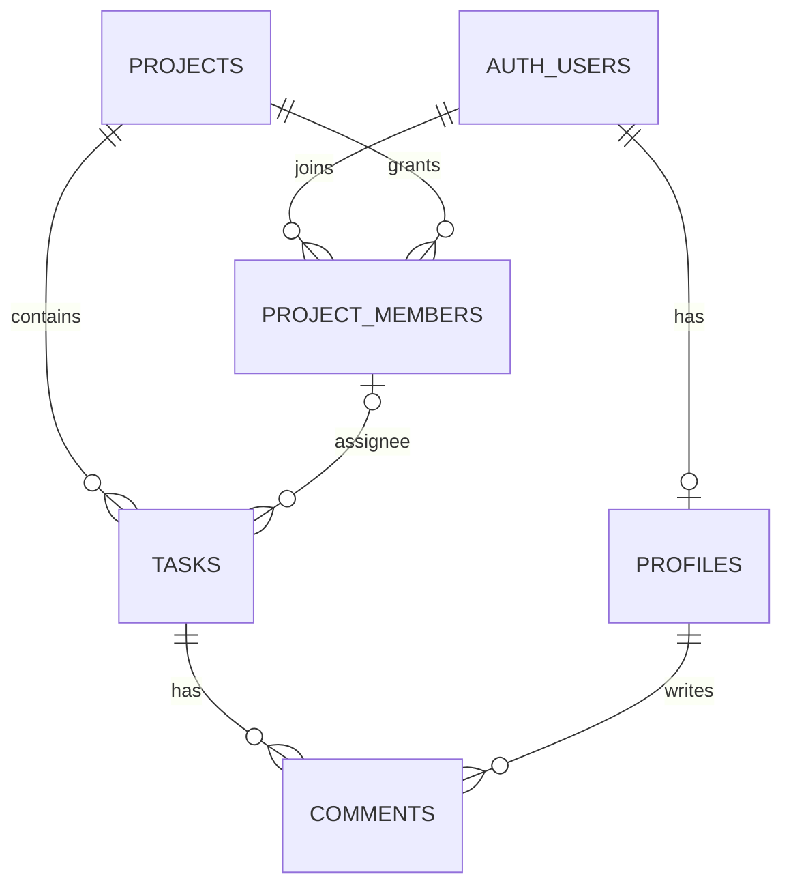

# 项目完整路线图

> 目标是多人协作的项目任务列表。当前只管理项目、项目成员、任务和评论；不设置团队层级。

## 1. 首版范围

- 用户注册、登录、维护个人显示名称。
- 登录用户可以创建项目；仅受邀用户可以加入。
- 项目列表只显示本人创建或加入的项目；本人创建的项目标注 `(owner)`。
- 创建者是项目组长；组长可移除成员、转让组长、归档/恢复和永久删除项目。
- 项目成员共同创建/编辑/指派任务、修改状态/优先级和发表评论；只能删除自己创建的任务。
- 系统管理员可以管理全部项目和任务；账号管理暂缓。
- 任务和评论仅对该项目成员开放，数据刷新后仍然保留。
- 当前不做团队管理、账号管理、邮件邀请、实时推送、拖拽和统计。邀请采用项目组长生成的一次性限时链接。
- Supabase 提供 Auth 与 PostgreSQL；Vercel 托管 Vite 前端。

## 2. 当前实现状态（2026-10-04）

> 邀请功能的近期交付状态以 2026-10-04 的更新提交为准：`55599f1` 已进入 `main`/`origin/main`，邀请数据库迁移已应用。是否已自动部署至 Vercel、真实浏览器兑换是否成功，尚待确认。

- React、TypeScript、Ant Design、React Router、TanStack Query 和 Zustand 已接入。
- Supabase Auth、项目、项目成员、任务、评论和个人资料 API 已接入。
- 项目创建者自动成为 owner；普通用户仅能读取自己已关联的项目，通过限时邀请加入。公开项目发现和直接自行加入已关闭。
- 看板提供任务 CRUD、状态/优先级、项目成员指派和评论。
- 项目成员关系已改为直接关联项目。远程迁移移除了团队表和团队外键，并保留现有数据：2 个项目、2 条项目成员关系、4 条任务、1 条评论。
- 用户已确认第二个账号能够正常访问项目并参与操作。生产构建和 lint 已通过；Vercel 已正式部署，线上地址为 [tasks-board-swart.vercel.app](https://tasks-board-swart.vercel.app)。用户确认部署和主流程验收已完成；邮箱验证回跳配置据用户判断已连通，建议再抽查一次邮件链接。
- 系统管理员私有身份记录、项目 `owner/member` 和任务删除角色限制已实现。2026-10-04 维护者已用 A/B/C 三账号通过创建/加入、成员删除本人/他人任务、owner 删除成员任务、管理员未加入也能按链接管理任务的页面测试。
- 尚未实现：任务删除按钮权限、组长成员管理与项目生命周期、管理员全部项目入口和跨账号自动刷新。邀请的生产页面验收待做。验证证据及已知问题见[权限验证记录](./权限验证记录.md)。

## 3. 数据与权限

- `profiles` 存用户显示名称；本人可以更新。
- `projects` 存项目名称和创建者；项目名称忽略大小写和首尾空格后全局唯一。
- `project_members.role` 已区分 `owner/member`；每个项目最多一位 owner，创建项目时自动建立 owner 关系。转让尚未实现。
- `private.system_admins` 记录应用系统管理员，只能由受信任 SQL 管理；不向浏览器暴露管理员表或服务密钥。
- `tasks` 通过项目 ID 归属项目，负责人必须是该项目成员。
- `comments` 通过任务归属项目，读写权限继承项目成员关系。
- 普通登录用户只能查看已创建或已加入的项目；加入需 owner/admin 生成的单人或多人限时邀请。
- 当前 owner 可改名，系统管理员可管理及永久删除项目；owner 的成员管理、转让、归档、恢复和永久删除权限及界面待实现。
- 普通成员已禁止删除他人任务；owner 可删除本项目全部任务；系统管理员可跨项目管理项目和任务，不管理账号。

## 4. 上线后及按需改进

### 建议补验

1. 验收当前邀请前端在生产站点的单人/多人生成、未登录后续接和兑换流程。
2. 确认普通未加入账号不能发现/读取项目，也不能读取任务、评论或成员资料；管理员访问按独立身份放行。
3. 按需运行测试套件、检查窄屏和长标题输入，并考虑把 lint、测试、build 接入 CI。

### 权限收敛（进行中）

1. 已完成角色与任务删除数据库基础，管理员已由维护者登记，三账号页面验收通过。
2. 验收已提交的双模式邀请前端和未登录后续接。
3. 完成任务删除按钮权限和零行删除反馈。
4. 完成跨账号自动刷新，优先评估可见页面定时刷新和返回页面刷新。
5. 完成管理员全部项目入口；账号管理继续暂缓。
6. 分次完成组长移除成员、转让、归档/恢复和永久删除项目。
7. 按变更范围验收并更新 Vercel；复用已通过的权限基线。每项具体提交边界见《待完善功能与开发顺序》。

### 暂不做

- 账号管理、邮件邀请、实时推送、拖拽排序、报表和性能优化；只有出现真实需求后再评估。

## 5. 开发和发布约定

- 每次改动聚焦一个可独立检查的结果；检查当前代码和数据库，不以旧文档替代事实。
- 按业务 feature 组织前端代码；Supabase SDK 已是 HTTP 数据客户端，不再重复包一层请求传输实现。可在页面/hooks 边界稳定后增加 `src/api/index.ts` 作为统一公开出口，提升能力发现和导入路径稳定性。
- `App.tsx` 逐步收敛为路由与页面入口；页面、TanStack Query hooks、Supabase 数据访问分层，但只在现有复杂度需要时拆分。
- 权限界面逻辑可集中维护，真实授权必须由 Postgres GRANT/RLS 保证；不以隐藏按钮或前端 guard 代替数据库策略。
- 暂不引入 Express、Prisma、Repository Pattern 或完整 DDD 分层；出现多后端、多数据源或可复用复杂用例后再评估。
- 数据库结构只通过新的 Supabase 迁移修改，同时检查列权限、RLS、外键和级联行为。
- 前端只使用 Supabase URL 和公开 key；service role key 不得放入 `VITE_*` 环境变量。
- 运行与改动相匹配的构建或检查，记录未验证项；不自动提交、推送或部署。
- `.env.local` 保持本地，不读取或提交密钥；`.env.example` 只保留占位值。
