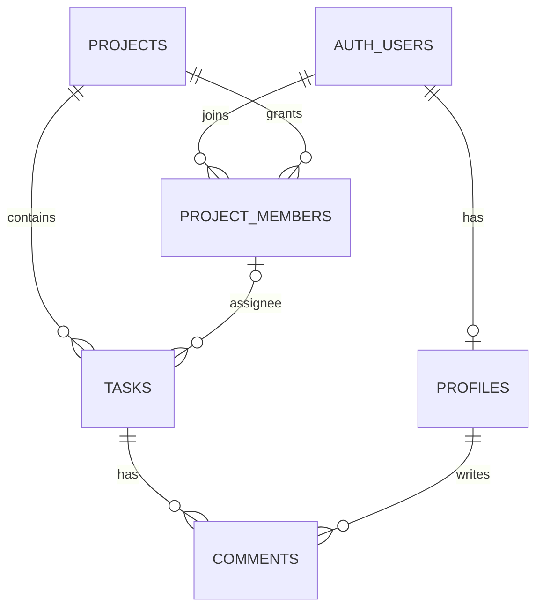

# 项目完整路线图

> 目标是多人协作的项目任务列表。当前只管理项目、项目成员、任务和评论；不设置团队层级。

## 1. 首版范围

- 用户注册、登录、维护个人显示名称。
- 登录用户可以创建项目；仅受邀用户可以加入。
- 项目列表只显示本人创建或加入的项目；本人创建的项目标注 `(owner)`。
- 创建者是项目组长；组长可移除成员、转让组长、归档/恢复和永久删除项目。
- 项目成员共同创建/编辑/指派任务、修改状态/优先级和发表评论；只能删除自己创建的任务。
- 系统管理员可以管理全部项目和任务；账号管理暂缓。
- 任务和评论仅对该项目成员开放，数据刷新后仍然保留。
- 当前不做团队管理、账号管理、邮件邀请、实时推送、拖拽和统计。邀请采用项目组长生成的一次性限时链接。
- Supabase 提供 Auth 与 PostgreSQL；Vercel 托管 Vite 前端。

## 2. 当前实现状态（2026-10-02）

- React、TypeScript、Ant Design、React Router、TanStack Query 和 Zustand 已接入。
- Supabase Auth、项目、项目成员、任务、评论和个人资料 API 已接入。
- 当前实现仍是开放加入：项目创建者自动成为项目成员；任何已登录用户可浏览项目 ID/名称并为自己加入项目。
- 看板提供任务 CRUD、状态/优先级、项目成员指派和评论。
- 项目成员关系已改为直接关联项目。远程迁移移除了团队表和团队外键，并保留现有数据：2 个项目、2 条项目成员关系、4 条任务、1 条评论。
- 用户已确认第二个账号能够正常访问项目并参与操作。生产构建和 lint 已通过；Vercel 已正式部署，线上地址为 [tasks-board-swart.vercel.app](https://tasks-board-swart.vercel.app)。用户确认部署和主流程验收已完成；邮箱验证回跳配置据用户判断已连通，建议再抽查一次邮件链接。
- 2026-10-02 已确认下一阶段权限需求：仅邀请加入、项目列表私有、系统管理员管理全部项目和任务（不管理账号）、项目组长管理成员和项目生命周期、成员不能删除他人任务。这些规则尚未进入代码或远程数据库。

## 3. 数据与权限

- `profiles` 存用户显示名称；本人可以更新。
- `projects` 存项目名称和创建者；项目名称忽略大小写和首尾空格后全局唯一。
- 当前 `project_members` 只记录成员关系，没有组长角色；目标是在项目成员关系中区分组长与普通成员。
- `tasks` 通过项目 ID 归属项目，负责人必须是该项目成员。
- `comments` 通过任务归属项目，读写权限继承项目成员关系。
- 当前登录用户可查看项目名称并自行加入；目标改为只能查看自己创建或加入的项目，未加入者通过一次性限时邀请链接入项。
- 当前项目创建者可改名和删除项目；目标由组长管理改名、成员、组长转让、归档、恢复和永久删除。
- 目标成员权限禁止删除他人任务；系统管理员可跨项目管理项目和任务，不管理账号。

## 4. 上线后及按需改进

### 建议补验

1. 确认新注册邮箱验证链接最终回到 `https://tasks-board-swart.vercel.app`。
2. 验证未加入项目的账号只能看到项目名称，不能读取任务、评论和成员资料。
3. 按需运行测试套件、检查窄屏和长标题输入，并考虑把 lint、测试、build 接入 CI。

### 权限收敛（下一阶段）

1. 建立全局系统管理员及项目 `owner/member` 角色，并安全指定首位系统管理员。
2. 关闭公开项目发现和自行加入；组长可生成一次性限时邀请链接，成员兑换后才加入。
3. 限制普通成员删除任务为仅可删除本人创建的任务；管理员可跨项目管理任务。
4. 加入组长成员管理、组长转让、归档/恢复和永久删除项目。
5. 更新项目列表、权限文档和迁移注释，说明实际策略；完成双账号和未授权访问验收。

### 暂不做

- 账号管理、邮件邀请、实时推送、拖拽排序、报表和性能优化；只有出现真实需求后再评估。

## 5. 开发和发布约定

- 每次改动聚焦一个可独立检查的结果；检查当前代码和数据库，不以旧文档替代事实。
- 按业务 feature 组织前端代码；Supabase SDK 已是 HTTP 数据客户端，不再重复包一层请求传输实现。可在页面/hooks 边界稳定后增加 `src/api/index.ts` 作为统一公开出口，提升能力发现和导入路径稳定性。
- `App.tsx` 逐步收敛为路由与页面入口；页面、TanStack Query hooks、Supabase 数据访问分层，但只在现有复杂度需要时拆分。
- 权限界面逻辑可集中维护，真实授权必须由 Postgres GRANT/RLS 保证；不以隐藏按钮或前端 guard 代替数据库策略。
- 暂不引入 Express、Prisma、Repository Pattern 或完整 DDD 分层；出现多后端、多数据源或可复用复杂用例后再评估。
- 数据库结构只通过新的 Supabase 迁移修改，同时检查列权限、RLS、外键和级联行为。
- 前端只使用 Supabase URL 和公开 key；service role key 不得放入 `VITE_*` 环境变量。
- 运行与改动相匹配的构建或检查，记录未验证项；不自动提交、推送或部署。
- `.env.local` 保持本地，不读取或提交密钥；`.env.example` 只保留占位值。
