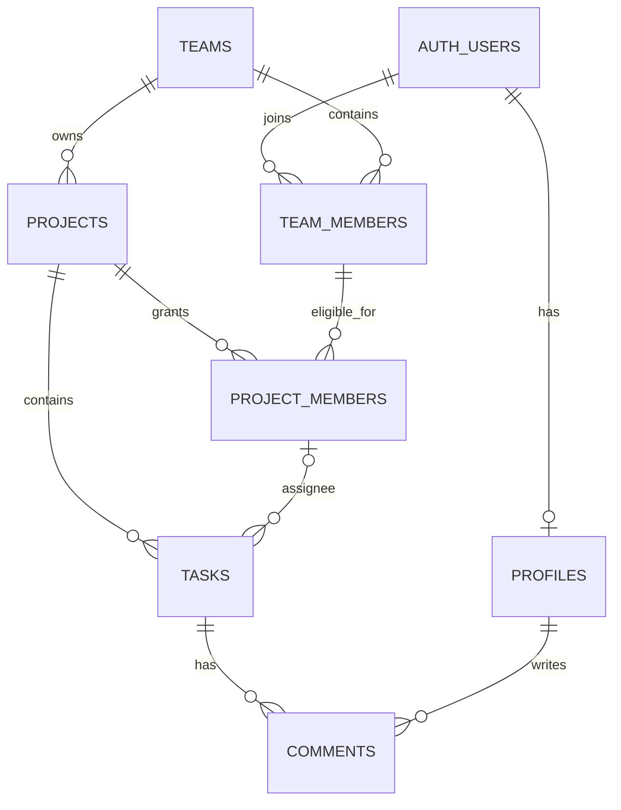

# React Kanban 项目完整路线图

> 面向你和几位共同开发伙伴的小团队项目看板。本文记录项目的当前状态、后续阶段、技术选择、验收条件和协作约定。路线按小步交付推进；每次对话聚焦一个可检查的任务，不把整条路线一次性实现。

## 1. 项目目标与默认范围

- **目标用户**：一个固定小团队及其共同开发伙伴。
- **首版范围**：一个团队、团队内多个项目；成员登录后查看有权限的项目，创建和维护任务、指派成员、讨论任务。
- **首版暂不要求**：多团队工作区、实时推送、复杂报表、企业级组织功能。
- **当前部署方向**：Supabase 提供 Auth 和 PostgreSQL；Vercel 部署 Vite 前端。
- **SMTP**：按当前决定暂缓配置。需要真实邮件邀请或正式邮件验证时，再单独安排该项及其验收。
- **数据迁移**：当前演示任务不作为正式数据迁移；接数据库时从新的团队和项目数据开始。

## 2. 当前状态（核对日期：2026-09-30）

### 已实现

- Vite、React、TypeScript 前端；React Router 管理项目、看板和设置路由。
- 使用 Ant Design 作为主要组件库；TanStack Query 管理任务及评论的异步数据，Zustand 管理看板筛选和界面状态。
- Supabase 客户端配置和登录/注册/会话恢复/退出登录界面已接入。缺少 Supabase 环境配置时，本地开发提供演示模式；生产构建界面提示需要配置。
- 看板支持创建任务、编辑标题/优先级/负责人、切换状态、删除、搜索与状态筛选；任务详情支持评论基础操作。
- 项目列表、团队/项目创建及看板任务与评论 API 已接入 Supabase；用户已确认主要 CRUD、评论和刷新持久化可用。最新 `profiles` 资料补齐操作因列级授权不匹配报错；代码已改为仅插入资料或更新 `display_name`，等待刷新页面确认。
- 筛选纯函数和 `TaskCard` 完成回调已有 Vitest 测试；`package.json` 已配置 `test`、`lint`、`build` 脚本。

### 尚未完成或未验证

- 项目页已连接 Supabase，可查看团队可访问项目、创建团队和项目；用户已确认团队、项目及任务卡片创建成功。设置页已有个人显示名称表单；成员管理/邀请界面尚未完成。
- Supabase 迁移已应用到远程项目：建立 `profiles`、团队/项目成员、项目、任务、评论表并启用 RLS；同一团队项目名称已有唯一索引。前端已接入项目、任务和评论数据访问；多人权限场景仍待验收。
- 没有邀请邮件流程；SMTP 按当前决定暂缓。
- 没有端到端测试、CI 流水线、Vercel 生产部署或正式环境验收记录。
- 本文编写时未重新运行测试、lint 或 build；后续实施任务应根据改动范围执行验证并记录结果。

权限角色、表授权、RLS 策略和授权边界详见《用户权限与数据访问》；优先级、剩余功能及验收顺序详见《待完善功能与开发顺序》。

## 3. 实施路线

### 阶段 A：文档与基础质量

**目标**：让每次开发都能从当前状态出发，完成一个范围清楚、可验证、可回退的小任务。

**工作项**

1. 将本文和《阶段进度速查》作为项目计划入口；每次开发前确认本轮任务和前置条件。
2. 检查登录状态恢复、登录/注册错误反馈、退出登录和环境变量示例；不把 `.env.local` 内容写入文档或 Git。
3. 继续维护筛选工具测试和关键组件回调测试；每个功能任务增加与行为直接相关的测试，不追求对 Ant Design 等依赖本身做测试。
4. 统一关键页面的加载、空数据、失败重试、操作中和失败反馈行为。

**验收条件**

- 新开发者能按仓库文档了解如何启动、测试和确定当前进度。
- 任务操作的成功和失败都有可理解的反馈；失败不会让界面永久停留在错误状态。
- 受影响测试通过；阶段检查时 `npm run test`、`npm run lint`、`npm run build` 均通过。

### 阶段 B：Supabase 数据库与权限

**目标**：建立可持久化的数据模型，并确保数据访问由数据库权限规则最终控制。schema 已应用，项目/任务/评论数据 API 已接入；后续重点是实际账号流程和权限边界验收。

**建议顺序**

1. 只读检查 Supabase 项目中现有表、认证设置和迁移状态，确认当前项目是否为空；不要直接假定线上数据库状态。
2. 确定最小关系模型并记录：用户资料、团队、团队成员关系、项目、任务、评论。任务属于项目，评论属于任务，负责人对应团队成员；保留 `todo` / `doing` / `done` 和 `low` / `medium` / `high`。
3. 通过 Supabase CLI 迁移管理 schema 变更；逐表启用 RLS，配置必要的表权限和策略。每条策略都要按普通成员、项目管理员、无关账号分别验证读写边界。
4. 设计受信任的邀请流程：管理密钥不能出现在浏览器或 Vite 环境变量中。邀请邮件发送需要服务端能力和 SMTP；SMTP 暂缓期间只做方案与权限边界，不宣称邮件邀请已可用。
5. 将前端数据访问集中在现有 API/data-access 边界，逐项替换 Mock API；Query 缓存键应包含用户/项目等必要范围，写入后按范围失效或重新获取。（任务与评论已切换到 Supabase API。）
6. 对断网、权限拒绝、记录不存在和写入失败提供反馈；服务端返回的数据作为最终状态，避免乐观界面被误认为已持久化。

**当前数据模型（2026-09-30）**

- `profiles`：`auth.users` 的应用资料，主键直接引用 Auth 用户 ID，只存展示名等非认证资料。
- `teams`：团队；`team_members`：团队与用户的关联，角色先限定 `admin` / `member`。
- `projects`：隶属一个团队；`project_members`：项目授权成员，复合主键 `(project_id, user_id)`，同时保存 `team_id` 以复合外键引用团队成员关系，避免非团队成员被加入项目。
- `tasks`：隶属项目，保留 `todo` / `doing` / `done` 与 `low` / `medium` / `high`；`assignee_user_id` 可空，并以 `(project_id, assignee_user_id)` 复合外键指向 `project_members`，保证负责人属于该项目。
- `comments`：隶属任务并记录作者；通过任务所属项目继承访问范围。
- ID 使用 UUID；业务表时间字段使用 `timestamptz`，任务和评论由服务端生成 ID 与创建时间。演示数据不迁移。

**当前权限策略**：项目成员可读取授权项目及其任务、评论；项目成员可创建任务和评论，并更新任务字段；团队管理员可管理团队成员、项目与项目成员；非团队成员无权读取或写入。所有业务表已启用 RLS；迁移明确撤销 `anon`、`authenticated` 和 `PUBLIC` 的默认表权限，再仅授予登录角色所需权限。资料表只允许本人修改，读取范围限于有共同团队关系的用户。最后一个管理员保护、删除用户时的关联清理和成员邀请流程仍待后续实现；邀请邮件继续受 SMTP 暂缓决定约束。策略的实际成员/管理员越权边界尚未通过多账号场景验收。

该模型基于路线图的团队、项目成员、任务负责人需求及当前 Mock 字段。Data API 已启用；数据库查询确认默认新表权限包含 `anon` 与 `authenticated`，迁移逐表撤销并重新授予最小权限。Supabase Dashboard 中暴露 schema 列表尚未读取。

**验收条件**

- 迁移可在空环境按顺序应用，且 schema 变更可在 Git 中审查。
- 至少两个不同账号加入同一团队后能访问授权项目；非成员不能读写该团队的数据。
- 成员和管理员权限差异由数据库策略验证，而不是只靠前端按钮禁用。
- 一个真实任务流程从加载到写入、刷新后重新读取均使用 Supabase；Mock 行为不再被误认为线上持久化数据。

### 阶段 C：项目与协作功能

**目标**：让团队成员可以用项目组织日常任务，并在任务上下文中协作。

**工作项**

1. 项目页显示当前用户有权访问的项目，支持创建团队/项目和进入对应看板；代码已接入，待实际账号操作确认。
2. 提供项目成员查看和管理；成员身份与任务负责人选择使用真实用户/成员记录，不继续使用任意文本作为最终身份。
3. 任务创建、编辑、状态和优先级变更、项目成员指派、删除确认及评论均已接入 Supabase API；待实际账号流程操作确认。
4. 设置页提供个人资料基础信息和退出登录；明确账号资料与团队成员资料的边界。
5. 对多人更新以服务端数据为准，显示失败并重新获取数据；统一日期显示、空态和错误提示。
6. 优化窄屏布局、键盘操作、焦点顺序、表单标签、长标题和无项目等情况。

**验收条件**

- 两名团队成员可从项目列表打开有权访问的项目并完成任务协作。
- 项目、负责人和评论展示的是持久化关联数据；刷新后仍可读取。
- 未授权的成员管理或项目访问被数据库拒绝，并在界面呈现可理解提示。
- 核心操作可通过键盘完成，窄屏下主要流程可使用。

### 阶段 D：测试、CI 与部署

**目标**：在发布前验证关键用户流程、安全边界和生产环境行为。

**测试分层**

- **单元测试**：筛选纯函数覆盖关键词、状态、组合条件、空条件；组件测试只验证项目自身回调、状态反馈等行为。
- **数据/权限测试**：验证数据库策略的允许与拒绝场景，覆盖团队成员、管理员和非成员；数据库工具按 Supabase CLI、可用的 Supabase MCP 或官方支持方式选择，执行结果要留记录。
- **端到端测试**：覆盖登录、进入项目、任务创建/状态更新/评论和权限隔离。需要真实浏览器流程时优先评估 Playwright，再确认是否引入依赖。
- **CI**：将 lint、目标测试和 build 纳入 GitHub Actions 或仓库实际使用的 CI 服务；数据库迁移检查按可用的 Supabase CLI 工作流加入。
- **部署冒烟**：检查正式网址、认证回调、项目路由直接访问和刷新、关键任务流程及权限拒绝。

**部署步骤**

1. 为本地、预览和生产环境明确变量清单。前端只配置 Supabase URL 和公开 publishable/anon key；绝不把 service role key 放入 `VITE_*` 变量。
2. 配置 Supabase Auth 的站点 URL 与允许的回调 URL；真实邮件流程上线前另行配置 SMTP。
3. 配置 Vercel 构建命令和环境变量，设置 Vite SPA 深链接 fallback，使 `/projects/:projectId/board` 直接访问与刷新可用。
4. 部署前审查迁移、RLS 和正式环境数据目标；先在预览/非生产环境验证迁移与关键流程，再发布正式环境。
5. 检查仓库与构建产物中没有密钥；确认正式部署能登录、访问授权项目、完成任务流程和正确拒绝越权。
6. 由你和伙伴先试用一个迭代周期，收集真实问题后再决定新增功能和优化优先级。

**验收条件**

- CI 对变更执行 lint、相关测试和构建；合并前检查结果通过。
- 正式网址可直接访问和刷新看板深层路由。
- 两个账号的项目隔离、登录、任务写入和权限拒绝通过生产冒烟或安全的预发布验收。
- 环境变量、迁移应用和回滚/恢复责任有可查的操作说明；SMTP 未配置时清楚标记邀请邮件不可验收。

### 阶段 E：第二阶段体验（不作为首版上线条件）

#### 拖拽与排序

- 先定义排序规则、跨状态拖放规则及持久化字段，再实现交互。
- 优先评估 `dnd-kit` 等成熟依赖，确认 React 版本兼容、键盘可访问性、维护状况和所需功能后再加入。
- 覆盖可见拖放目标、排序更新、服务端失败回滚、键盘移动和屏幕阅读器提示。
- 拖拽更新必须通过正式数据访问层保存；不能只改变本地卡片位置。

#### 统计

- 以稳定的真实任务数据为前提，先实现状态任务数量等简单指标。
- 先评估成熟图表依赖是否适合项目体积和无障碍需求；避免为少量指标手写图表引擎。
- 统计结果必须注明数据范围和更新时间；图表不作为首版发布阻塞条件。

#### 性能

- 先检查真实数据、请求次数、缓存键、包体积和用户反馈。
- 只有任务数量和测量结果证明有需要时，再评估分页、虚拟列表、懒加载或代码分包；不预先引入复杂优化。

## 4. 技术栈与依赖原则

### 当前已使用

| 用途 | 当前选择 |
| --- | --- |
| 前端构建 | Vite、TypeScript |
| UI | React 19、Ant Design 6、`@ant-design/icons` |
| 路由 | React Router 7 |
| 服务端数据与异步状态 | TanStack Query 5 |
| 界面状态 | Zustand 5 |
| 认证/数据库客户端 | `@supabase/supabase-js` 2；当前只有 Auth 接入真实服务 |
| 单元/组件测试 | Vitest、Testing Library、jsdom |

### 计划服务与工具

| 目标 | 计划选择 | 引入时机 |
| --- | --- | --- |
| Auth、PostgreSQL、RLS | Supabase | 数据库阶段 |
| 前端托管 | Vercel | 发布阶段 |
| 迁移与本地数据库工具 | Supabase CLI | 首次 schema 设计/迁移前 |
| 浏览器 E2E | 优先评估 Playwright | 登录与多账号真实流程开始测试时 |
| 拖拽 | 优先评估 `dnd-kit` | 第二阶段拖拽任务 |
| 图表 | 根据需求选成熟图表库 | 可靠任务数据和指标定义完成后 |
| 邮件发送 | Supabase Auth 邮件服务/SMTP 配置，必要时受信任服务端函数 | 用户决定启用邀请邮件时 |

### 依赖优先规则

1. 先检查当前已安装的 Ant Design、React Router、TanStack Query、Zustand、Supabase SDK 和测试工具能否完成需求。
2. 缺少能力时优先寻找成熟依赖，不因“自己写更快”就手写通用组件、拖拽、图表、表单基础设施或缓存逻辑。
3. 引入新依赖前，确认 React/TypeScript 兼容性、维护活跃度、无障碍支持、包体积和许可证；把选择及原因写进本任务记录或 ADR。
4. 仅在规则属于项目业务、依赖无法合理表达或成本明显不合适时，才手写业务逻辑；保持逻辑可测试并避免重复实现已有库能力。

## 5. 每轮开发、文档和 Git 约定

每轮任务按以下步骤进行：

1. 从《阶段进度速查》确认当前阶段、阻塞项和本轮唯一目标。
2. 检查仓库现状和 Git 工作区，阅读相关代码；不能以旧计划代替当前代码事实。
3. 写明改动范围、非目标、依赖方案、验收条件和需要用户操作的外部步骤（如 Supabase 控制台、SMTP、Vercel）。
4. 实现一个可独立检查的纵向小任务；完成适用测试、lint 或 build，不为了覆盖率测试第三方组件内部行为。
5. 更新本轮涉及的路线/进度；准确记录已实现、未验证、被外部条件阻塞的事项。
6. 检查 `git diff` 和 `git status`，向你总结文件、验证和风险。你负责 Git commit；每个可验收阶段形成一个清晰提交，除非你明确要求，不自动提交、推送或部署。

### 一轮任务的完成定义

- 任务只有一个主要用户可见结果或一个基础设施结果。
- 有明确验收条件，相关验证通过或明确注明未通过原因。
- 不包含未授权的外部发布、部署、邮件发送或不可逆数据修改。
- 文档与代码现状一致；任务可通过一个 Git diff/提交独立审阅。

## 6. 外部操作与安全边界

- `.env.local` 只放本地，不读取其密钥内容、不提交；`.env.example` 仅保留占位值。
- 浏览器端允许使用 Supabase URL 和公开 publishable/anon key；RLS 是数据安全边界。公开 key 不是数据库授权策略。
- Supabase service role/管理密钥只能用于受信任服务端环境，不得放入 Vite 前端或任何 `VITE_*` 环境变量。
- 数据库迁移、正式数据变更、部署和密钥配置按独立任务进行；实施前确认目标环境并核对操作结果。
- 目前 SMTP 暂缓。需要用户在 Supabase/Vercel/Git 托管平台完成的操作，应在对应任务中给出具体路径、字段/命令和验收方式，而不是假定已完成。

## 7. 重要决策的记录

当选择会影响数据结构、权限边界、服务提供商、接口兼容或后续维护成本时，记录一条轻量 ADR，内容包括：

- 背景：为什么需要做这个决定。
- 决定：选择了什么、明确不做什么。
- 影响：会带来哪些后续工作、限制或迁移成本。
- 状态和日期：提议、已接受、已替代等状态及日期。

不要为了小型实现细节增加 ADR；不要把仍待用户确认的事项写成已接受决定。
