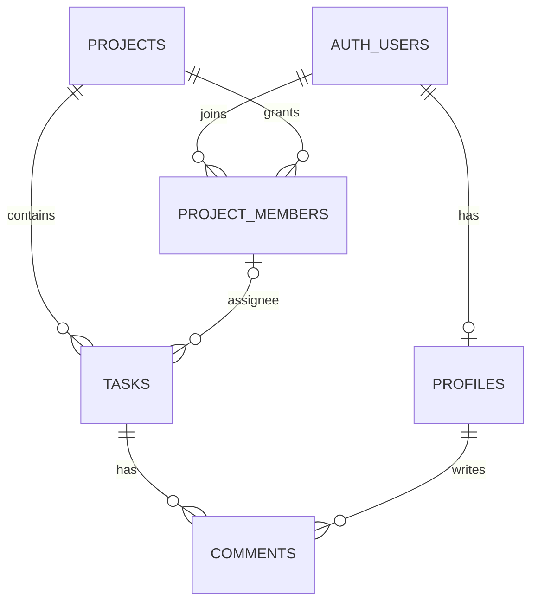

# 项目完整路线图

> 目标是多人协作的项目任务列表。当前只管理项目、项目成员、任务和评论；不设置团队层级。

## 1. 首版范围

- 用户注册、登录、维护个人显示名称。
- 登录用户可以创建项目；仅受邀用户可以加入。
- 项目列表只显示本人创建或加入的项目；本人创建的项目标注 `(owner)`。
- 创建者是项目组长；组长可移除成员、转让组长、归档/恢复和永久删除项目。
- 项目成员共同创建/编辑/指派任务、修改状态/优先级和发表评论；只能删除自己创建的任务。
- 系统管理员可以管理全部项目和任务；账号管理暂缓。
- 任务和评论仅对该项目成员开放，数据刷新后仍然保留。
- 当前不做团队管理、账号管理、邮件邀请、实时推送和统计。邀请采用项目组长生成的一次性限时链接；卡片拖拽列入下一阶段。
- Supabase 提供 Auth 与 PostgreSQL；Vercel 托管 Vite 前端。

## 2. 当前实现状态（2026-10-04）

> 邀请功能已于 `55599f1` 提交；权限与协作检查点为 `ac9c5b9`、`33768b9`。用户已确认两个检查点上线后的功能均正常。当前进入 UI 美化与任务卡片拖拽阶段。

- React、TypeScript、Ant Design、React Router、TanStack Query 和 Zustand 已接入。
- Supabase Auth、项目、项目成员、任务、评论和个人资料 API 已接入。
- 项目创建者自动成为 owner；普通用户仅能读取自己已关联的项目，通过限时邀请加入。公开项目发现和直接自行加入已关闭。
- 看板提供任务 CRUD、状态/优先级、项目成员指派和评论。
- 项目成员关系已改为直接关联项目。远程迁移移除了团队表和团队外键，并保留现有数据：2 个项目、2 条项目成员关系、4 条任务、1 条评论。
- 用户已确认第二个账号能够正常访问项目并参与操作。生产构建和 lint 已通过；Vercel 已正式部署，线上地址为 [tasks-board-swart.vercel.app](https://tasks-board-swart.vercel.app)。用户确认部署和主流程验收已完成；邮箱验证回跳配置据用户判断已连通，建议再抽查一次邮件链接。
- 系统管理员私有身份记录、项目 `owner/member` 和任务删除角色限制已实现。2026-10-04 维护者已用 A/B/C 三账号通过创建/加入、成员删除本人/他人任务、owner 删除成员任务、管理员未加入也能按链接管理任务的页面测试。
- 已实现并由用户完成生产验收：按角色显示任务删除操作、跨账号定时/前台刷新、管理员全部项目入口、owner 成员移除/转让、项目归档/恢复/永久删除。验证记录见[权限验证记录](./权限验证记录.md)。

## 3. 数据与权限

- `profiles` 存用户显示名称；本人可以更新。
- `projects` 存项目名称和创建者；项目名称忽略大小写和首尾空格后全局唯一。
- `project_members.role` 已区分 `owner/member`；每个项目最多一位 owner，创建项目时自动建立 owner 关系；owner 可转让给现有成员。
- `private.system_admins` 记录应用系统管理员，只能由受信任 SQL 管理；不向浏览器暴露管理员表或服务密钥。
- `tasks` 通过项目 ID 归属项目，负责人必须是该项目成员。
- `comments` 通过任务归属项目，读写权限继承项目成员关系。
- 普通登录用户只能查看已创建或已加入的项目；加入需 owner/admin 生成的单人或多人限时邀请。
- owner 可改名、移除成员、转让组长、归档/恢复/永久删除项目；系统管理员可跨项目管理项目和任务。
- 普通成员已禁止删除他人任务；owner 可删除本项目全部任务；系统管理员可跨项目管理项目和任务，不管理账号。

## 4. 上线后及按需改进

### 当前收尾与顺序

1. 用户已确认 Vercel 当前功能全部正常。
2. 下一阶段是 UI 美化和任务卡片拖拽。
3. 拖拽需要保存顺序，预计只增加任务排序字段及向前 migration；不重做角色权限或数据库基础架构。

### 权限收敛（已完成并通过生产验收）

1. 已完成角色、邀请数据库基础，管理员已登记，邀请操作和三账号权限测试由维护者确认通过。
2. 检查点 1 已提交：任务删除权限/反馈、跨账号刷新、管理员全部项目入口（`ac9c5b9`）。
3. 检查点 2 已提交：owner 成员管理、项目归档/恢复/永久删除（`33768b9`）。
4. 用户已确认两个检查点部署后的生产功能均正常；不再安排权限/数据库重做。

### 体验迭代：UI 美化与任务卡片拖拽（已在工作区实现）

1. 已整理项目列表、看板、任务卡片和详情面板视觉及窄屏布局，保留现有功能和操作路径。
2. 卡片支持鼠标、触屏和键盘拖动，可跨状态列移动和同列排序；排序保存在 Supabase，通过既有轮询同步。
3. 已应用 `20261004084548`：增加任务排序字段、索引和 invoker RPC；排序写入沿用当前项目角色与 RLS，归档项目保持只读。
4. UI 与拖拽合为同一工作轮次；lint/build 通过。实际生产页面、触屏和跨账号复核待维护者发布后执行。

### 暂不做

- 账号管理、实时推送、报表和架构重构继续暂缓；只有出现真实需求后再评估。

## 5. 开发和发布约定

- 两个权限与协作 Git 检查点及生产验收均已完成；当前 UI 与拖拽改动待维护者审阅和发布。按真实使用反馈决定之后是否增加其他功能。
- 按业务 feature 组织前端代码；Supabase SDK 已是 HTTP 数据客户端，不再重复包一层请求传输实现。可在页面/hooks 边界稳定后增加 `src/api/index.ts` 作为统一公开出口，提升能力发现和导入路径稳定性。
- `App.tsx` 逐步收敛为路由与页面入口；页面、TanStack Query hooks、Supabase 数据访问分层，但只在现有复杂度需要时拆分。
- 权限界面逻辑可集中维护，真实授权必须由 Postgres GRANT/RLS 保证；不以隐藏按钮或前端 guard 代替数据库策略。
- 暂不引入 Express、Prisma、Repository Pattern 或完整 DDD 分层；出现多后端、多数据源或可复用复杂用例后再评估。
- 数据库结构只通过新的 Supabase 迁移修改，同时检查列权限、RLS、外键和级联行为。
- 前端只使用 Supabase URL 和公开 key；service role key 不得放入 `VITE_*` 环境变量。
- 每次 Supabase 表/RLS/函数变化使用新 migration。由 AI 检查 SQL，先运行 `db push --linked --dry-run --skip-vault`，再应用 migration 并核对远程记录；AI 负责本项目 Supabase 部署。
- Vercel 前端由维护者管理 Git 提交和推送；若仓库连接正常，Vercel 根据推送构建部署。AI 不代替维护者提交或推送 Git。
- 运行与改动相匹配的构建或检查，记录未验证项。
- `.env.local` 保持本地，不读取或提交密钥；`.env.example` 只保留占位值。
