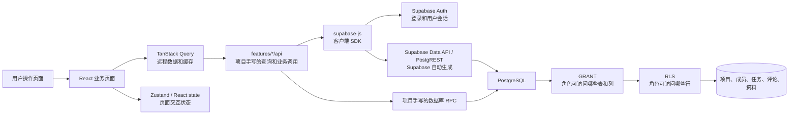

# React Kanban 项目源码阅读攻略

> 目标：用尽量短的路径理解这个项目怎样从浏览器页面走到 Supabase 和 PostgreSQL，读懂常见业务改动应该找哪些文件，并把 Supabase 提供的能力和项目自己编写的逻辑分开。本文按当前仓库源码整理；数据库最终状态应结合迁移文件顺序阅读，不能把早期迁移单独当作当前结构。

## 先记住项目全貌

这是一个 React 单页应用。浏览器负责呈现页面和响应操作，Supabase 提供登录认证、自动生成的数据库 REST API 和 PostgreSQL。项目没有自己搭建 Express / NestJS 之类的中间层 API 服务器。



读图时留意两个判断：Supabase 会从数据库结构生成 Data API，但它不会替项目编写业务流程；浏览器里的按钮控制显示，真正的数据权限要看数据库的 GRANT 和 RLS。

### 谁负责什么

| 部分 | 主要职责 | 从这里开始看 |
| --- | --- | --- |
| React | 页面、组件、表单和交互 | [`src/features/`](../src/features/) |
| React Router | URL 与页面对应 | [`src/app/App.tsx`](../src/app/App.tsx) |
| TanStack Query | 服务器数据查询、加载状态、缓存和写入后刷新 | [`src/main.tsx`](../src/main.tsx)、各页面的 `useQuery` / `useMutation` |
| Zustand | 看板搜索、筛选、当前打开的任务 | [`src/features/tasks/store/taskUiStore.ts`](../src/features/tasks/store/taskUiStore.ts) |
| `supabase-js` | 浏览器 Supabase 客户端；把 JS 查询转成 HTTPS Data API 请求 | [`src/lib/supabase.ts`](../src/lib/supabase.ts) |
| Supabase Auth | 注册、登录、会话令牌 | [`src/features/auth/`](../src/features/auth/) |
| Supabase Data API | 按数据库结构提供表、视图和函数的 REST 接口 | Supabase Dashboard 的 Integrations → Data API；官方[自动 API 文档](https://supabase.com/docs/guides/api/rest/auto-generated-docs) |
| PostgreSQL | 持久化、约束、事务、函数、表/列权限和 RLS | [`supabase/migrations/`](../supabase/migrations/) |
| Vercel | 托管已构建的前端网页 | [`vercel.json`](../vercel.json)、README 的部署说明 |

## 先用 30 分钟走一遍

| 时间 | 做什么 | 读哪些文件 | 学会回答的问题 |
| --- | --- | --- | --- |
| 5 分钟 | 看目录和运行脚本 | [`package.json`](../package.json)、[`src/main.tsx`](../src/main.tsx) | 应用从哪儿启动？为什么要包 Router 和 Query Provider？ |
| 5 分钟 | 看路由 | [`src/app/App.tsx`](../src/app/App.tsx) | `/projects` 和看板 URL 分别显示哪页？ |
| 5 分钟 | 看登录状态 | [`src/features/auth/AuthGate.tsx`](../src/features/auth/AuthGate.tsx)、[`AuthPage.tsx`](../src/features/auth/AuthPage.tsx) | 用户未登录、加载中、登录后各显示什么？ |
| 5 分钟 | 看后端连接 | [`src/lib/supabase.ts`](../src/lib/supabase.ts)、根目录 `.env.example` | 页面如何找到 Supabase 项目？浏览器里能放哪种 key？ |
| 10 分钟 | 跟一次任务读取 | [`BoardPage.tsx`](../src/features/tasks/pages/BoardPage.tsx)、[`taskApi.ts`](../src/features/tasks/api/taskApi.ts) | Query key、请求函数、数据库查询、错误显示在哪里？ |

如果时间够，再顺着“新建任务”从按钮一路读到数据库，再读“邀请成员”和“拖动排序”。按一条完整业务链读，比逐文件从上往下硬读更快。

## 启动项目时发生了什么

1. [`index.html`](../index.html) 提供网页根元素 `#root`。
2. [`src/main.tsx`](../src/main.tsx) 创建 React 根节点，并放入 `StrictMode`、`QueryClientProvider`、`BrowserRouter` 和 `AuthGate`。
3. [`src/lib/supabase.ts`](../src/lib/supabase.ts) 读取 Vite 环境变量并创建唯一的 Supabase 客户端。环境变量缺失时 `supabase` 为 `null`。
4. [`AuthGate.tsx`](../src/features/auth/AuthGate.tsx) 恢复已有 Supabase session，订阅登录状态变化：开发模式没配置 Supabase 时进入演示入口；配置了 Supabase 但未登录时显示登录/注册页；登录后包住正式应用。
5. [`src/app/App.tsx`](../src/app/App.tsx) 根据当前 URL 选择项目页、邀请页或任务看板。

本地快速运行：先用根目录 `.env.example` 的变量名创建 `.env.local`，填 Supabase Project URL 和 Publishable key，然后执行 `npm install`、`npm run dev`。环境变量要改名或改值时，重启 Vite 开发服务器。开发命令和部署步骤见 [`README.md`](../README.md)。不要把 `service_role` 或 Supabase Secret key 放入 `VITE_*` 变量。

## 目录地图：遇到需求先找哪里

```text
src/
├── main.tsx                       React 根节点、全局 Provider
├── app/
│   ├── App.tsx                    路由表、短项目 ID 的路由兼容
│   └── App.css                    全局及页面样式
├── lib/
│   └── supabase.ts                Supabase 客户端单例
└── features/
    ├── auth/                      注册、登录、会话、个人资料
    ├── projects/                  项目列表、邀请、成员、项目管理
    │   ├── api/                   项目域数据库请求
    │   ├── pages/                 项目页、邀请接受页
    │   └── components/            邀请与管理组件
    └── tasks/                     看板、任务、评论
        ├── api/                   任务与评论的数据请求
        ├── components/            卡片、列、工具栏、详情侧栏
        ├── pages/                 看板页面、Query 和拖拽编排
        ├── store/                 Zustand 看板交互状态
        ├── utils/                 纯筛选函数
        └── types.ts               领域数据类型

supabase/
├── config.toml                    Supabase CLI 本地开发配置
└── migrations/                    数据库变更历史，按时间顺序执行

docs/                              面向人的项目、权限、路线和学习说明
scripts/                           本地辅助/验证脚本
```

### 读 React 页面时分清三种代码

- **Page 页面**：负责把数据、动作、状态组合起来；例如 [`BoardPage.tsx`](../src/features/tasks/pages/BoardPage.tsx)。看到 `useQuery`/`useMutation` 时，这里在编排数据生命周期。
- **Component 组件**：负责单块 UI 和事件回调；例如 [`TaskCard.tsx`](../src/features/tasks/components/TaskCard.tsx) 展示卡片，把编辑、删除、详情事件交回页面。
- **API 函数**：负责一项具体数据操作；例如 [`taskApi.ts`](../src/features/tasks/api/taskApi.ts) 里的 `getTasks`、`createTask`。这个项目中的 `api/` 是浏览器侧的 Supabase 查询封装，不是自建 HTTP 后端。

一个常见调用形状：

```text
Page 里的用户事件
  -> useMutation(mutationFn)
  -> features/<领域>/api 的函数
  -> supabase.from("表").select/insert/update/delete 或 supabase.rpc("函数")
  -> Supabase Data API
  -> PostgreSQL 的 GRANT/RLS/函数/约束
  -> 成功后更新或失效 TanStack Query 缓存
```

## 三类状态：别把它们混成一个“全局状态”

| 状态 | 放在哪里 | 示例 | 为什么 |
| --- | --- | --- | --- |
| 服务器数据 | TanStack Query 缓存 | 项目、任务、成员、评论 | 来自 Supabase；有加载、错误、刷新、Mutation 生命周期。 |
| 共享界面状态 | Zustand | 搜索词、看板状态筛选、打开哪条任务详情 | 属于多个看板组件共享的临时 UI 状态，不是数据库事实。 |
| 局部交互状态 | React `useState` | 新任务输入框、弹窗开关、表单错误、正在编辑的任务 | 生命周期只属于一个页面或组件，不必放全局。 |

查看 [`taskUiStore.ts`](../src/features/tasks/store/taskUiStore.ts) 可见 Zustand 只保存少量 UI 状态。筛选是纯函数 [`filterTasks.ts`](../src/features/tasks/utils/filterTasks.ts)：原始任务列表不被改写，视图由“排序后任务 + 搜索词 + 筛选项”计算出来。

### TanStack Query 记法

- `useQuery`：读取服务器数据。`queryKey` 是缓存地址，`queryFn` 是实际读取函数，`enabled` 决定当前条件是否允许请求。
- `useMutation`：修改服务器数据。`mutationFn` 调 API，`onSuccess` 常用来清输入并刷新相关查询，`onError` 负责展示错误。
- `invalidateQueries({ queryKey: ["tasks"] })`：标记匹配的任务缓存过期，让仍在使用它的查询重新读取。
- 拖动排序采用乐观更新：先在 Query 缓存里显示新的顺序，请求失败时恢复旧缓存，再刷新服务端结果。实现见 [`BoardPage.tsx`](../src/features/tasks/pages/BoardPage.tsx)。

项目看板在 Query 中设置了定时刷新，并在窗口重新聚焦时刷新；它目前没有用 Supabase Realtime 做数据库变更订阅。具体参数以 [`BoardPage.tsx`](../src/features/tasks/pages/BoardPage.tsx) 为准。

## Supabase 初学者必懂的边界

### Supabase 替你做的事

- 托管 PostgreSQL 数据库和项目 Dashboard。
- Supabase Auth 提供邮箱认证和用户 session。
- PostgREST 从已暴露的数据库 schema 自动生成 REST Data API。
- `supabase-js` 提供 JS/TS 客户端，让页面用 `.from(...)` 和 `.rpc(...)` 调用服务。
- PostgreSQL 执行迁移定义的表约束、外键、函数、GRANT 和 RLS。

### 本项目自己写的事

- 业务页面、输入校验、查询选择字段、排序和错误反馈。
- `supabase/migrations/` 中的数据模型、表/列权限、RLS 和业务 RPC。
- API 函数把数据库 snake_case 字段映射成 UI TypeScript 领域模型。
- TanStack Query 的缓存键、刷新时机和写入后行为。

Supabase 自动提供通用表 API，不代表它知道“什么是项目 owner”“邀请只能用一次”或“归档后不可写”。这类业务行为分别由数据库迁移、RPC 和 React 代码落实。

### `from` 与 `rpc` 怎么选

```ts
// 直接对一张表做常见 CRUD 查询
const { data, error } = await supabase
  .from("tasks")
  .select("id, title, status")
  .eq("project_id", projectId);

// 调用数据库中的命名函数（RPC）
const { data, error } = await supabase.rpc("create_project", {
  project_name: name,
});
```

- `.from("tasks")` 是调用自动生成的表接口；`.select/.eq/.order/.insert/.update/.delete` 最终仍由 Postgres 权限决定。
- `.rpc("create_project", args)` 是调用我们在 SQL migration 中创建并授权的 Postgres 函数。多步操作需要原子执行、或不应允许客户端任意组合底层写入时，通常会封装成 RPC。
- 返回值通常是 `{ data, error }`。本仓库的 API 封装遇到错误会 `throw`，这样页面的 TanStack Query 能进入 error 状态或触发 `onError`。
- `VITE_SUPABASE_PUBLISHABLE_KEY` 是允许出现在浏览器的项目 key，不是权限开关。当前登录用户身份由 Auth session 提供，数据库 RLS 按身份过滤数据。

Supabase 会在 Dashboard 生成表和函数的 API 阅读文档；入口在项目 Settings → Data API → Docs（Dashboard 页面布局变化时，可从 Integrations → Data API 找 Docs）。也可参考官方[自动文档说明](https://supabase.com/docs/guides/api/rest/auto-generated-docs)以及[项目架构图](./项目架构图.md)。

## 数据库模型：先看“最终形状”，再看演化过程

主要业务表：

| 表 | 直观理解 | 关联 |
| --- | --- | --- |
| `profiles` | 应用显示名称等个人资料 | `id` 对应 `auth.users.id`；登录账号由 Supabase Auth 管理。 |
| `projects` | 看板项目 | `created_by` 记录创建者；当前 owner 角色以 `project_members.role` 为准；`archived_at` 标记归档。 |
| `project_members` | 项目与用户的多对多关系 | 一行是一个人加入一个项目；`role` 是 `owner` 或 `member`。 |
| `tasks` | 看板任务卡 | 属于项目；包含 `status`、`priority`、`assignee_user_id`、`created_by` 和持久化 `sort_order`。 |
| `comments` | 任务讨论 | 每条评论属于一个 task，记录作者和创建时间。 |
| `private.project_invitations` | 邀请凭证及状态 | 私有 schema 中保存凭证哈希、期限、模式和消费记录；不直接开放给浏览器。 |
| `private.system_admins` | 应用系统管理员清单 | 与 Supabase Dashboard 项目所有者、数据库角色 `service_role` 完全不同。 |

**读迁移的正确方法：** 从 [`20260930093203_create_core_team_project_task_schema.sql`](../supabase/migrations/20260930093203_create_core_team_project_task_schema.sql) 看最早表定义，再按文件名时间顺序读后续迁移，确认哪些列、策略和表被改掉。早期 schema 曾有 `teams` / `team_members`；[`20260930131433_remove_teams_use_project_members.sql`](../supabase/migrations/20260930131433_remove_teams_use_project_members.sql) 将关系展平到项目成员并移除了团队结构，所以不要把最早迁移当成现在仍存在的表清单。

后续几个有代表性的变化：

- [`20261003151530_project_roles_and_task_delete_permissions.sql`](../supabase/migrations/20261003151530_project_roles_and_task_delete_permissions.sql)：引入项目 owner/member 角色、系统管理员表，并细化任务删除能力。
- [`20261003160939_invite_only_project_membership.sql`](../supabase/migrations/20261003160939_invite_only_project_membership.sql) 和 [`20261003163828_support_project_invitation_modes.sql`](../supabase/migrations/20261003163828_support_project_invitation_modes.sql)：将新成员加入收口到邀请流程，并支持单人和多人邀请模式。
- [`20261004062124_project_membership_and_lifecycle.sql`](../supabase/migrations/20261004062124_project_membership_and_lifecycle.sql)：约束成员管理、owner 转让、归档/恢复与永久删除，并让归档项目只读。
- [`20261004084548_persist_task_sort_order.sql`](../supabase/migrations/20261004084548_persist_task_sort_order.sql)：增加 `sort_order` 并提供原子重排 RPC。

**不要把 migration 当作普通脚本随便改。** 已经应用过的迁移是数据库版本历史；后续要改结构时新建迁移。仓库 `supabase/config.toml` 主要描述 Supabase CLI 的本地开发配置，不是线上 Dashboard 的全部配置。

### GRANT、RLS、RPC 快速分辨

| 名称 | 它回答的问题 | 在哪里读 |
| --- | --- | --- |
| `GRANT` / `REVOKE` | 这个 PostgreSQL 角色能否碰这张表、这个列、这个函数？ | 创建 schema 和后续权限迁移 |
| RLS policy | 通过表门之后，用户能读、插入、更新、删除哪些行？ | 含 `create policy` / `alter table ... enable row level security` 的迁移 |
| 数据库 RPC | 一个以函数形式暴露的数据库操作；可在数据库侧校验并把多步写入放到同一事务 | migration 的 `create function` + 前端 `.rpc(...)` |

门禁顺序可记成：Data API 暴露对象 → PostgreSQL 表/列/函数授权 → RLS 按当前 `auth.uid()` 判断行 → 约束与函数代码执行。隐藏界面上的按钮只能改善界面体验，不能替代这些数据库检查。

## 按业务功能读源码

### 1. 登录和个人资料

```text
AuthPage 调用 Supabase Auth 注册/登录
  -> AuthGate 恢复或监听 session
  -> AuthSessionContext 让页面读取当前用户
  -> profileApi 按需读取/补齐 profiles
```

- 登录、注册表单与 Auth SDK：[`AuthPage.tsx`](../src/features/auth/AuthPage.tsx)
- session 生命周期与退出登录：[`AuthGate.tsx`](../src/features/auth/AuthGate.tsx)
- 子组件读取当前 session：[`AuthSessionContext.ts`](../src/features/auth/AuthSessionContext.ts)
- `profiles` 表的显示名同步：[`profileApi.ts`](../src/features/auth/profileApi.ts)

读的时候重点看：Supabase Auth 用户 `auth.users` 是认证账号；`public.profiles` 是本项目 UI 用的资料表。它们通过 user id 对应，但不是一回事。

### 2. 项目列表和创建项目

```text
ProjectsPage useQuery
  -> projectApi.getWorkspace
  -> 查 project_members 得到项目 id / 角色
  -> 查 projects 得到项目名称 / 归档状态

ProjectsPage 表单提交
  -> createProjectMutation
  -> projectApi.createProject
  -> supabase.rpc("create_project")
  -> 数据库函数原子创建项目和 owner 关系
```

- 页面查询、项目创建及管理员查看全部项目：[`ProjectsPage.tsx`](../src/features/projects/pages/ProjectsPage.tsx)
- 对数据库的项目、成员和项目管理动作：[`projectApi.ts`](../src/features/projects/api/projectApi.ts)
- 简化 URL 中的 UUID：[`projectIdCodec.ts`](../src/features/projects/projectIdCodec.ts)

项目列表里的“能不能显示全部”会由前端查询逻辑和数据库策略共同决定。`getAllProjects()` 里先检查系统管理员 RPC 是 UI 端的明确校验，PostgreSQL 的 RLS/授权仍是安全底线。

### 3. 邀请新成员加入

```text
项目管理页请求邀请资格
  -> 生成邀请时调用 create_project_invitation_with_mode RPC
  -> 页面得到一次性原始 token，放进 /invite#token=...
接受邀请页读 URL fragment
  -> 浏览器计算 token 的 SHA-256
  -> redeem_project_invitation RPC
  -> 数据库检查当前登录用户、哈希、过期/消费状态和项目
  -> 在一个事务中把用户加入 project_members
```

- 邀请权限、创建、解析、哈希与兑换：[`projectInvitationApi.ts`](../src/features/projects/api/projectInvitationApi.ts)
- 创建邀请和复制链接 UI：[`ProjectInviteButton.tsx`](../src/features/projects/components/ProjectInviteButton.tsx)
- 接受邀请及成功后跳转：[`ProjectInvitationPage.tsx`](../src/features/projects/pages/ProjectInvitationPage.tsx)
- 服务端表和事务函数：从 [`20261003160939_invite_only_project_membership.sql`](../supabase/migrations/20261003160939_invite_only_project_membership.sql) 开始，再读支持邀请模式的迁移。
- 当前邀请说明：[`邀请双模式与故障修复.md`](./邀请双模式与故障修复.md)、[`邀请加入项目实现与验证.md`](./邀请加入项目实现与验证.md)

注意：原始 token 只在生成时返回给调用者；数据库存的是哈希。邀请凭证是加入项目的证明，不能把它打印到日志或发到不可信位置。单人/多人模式的期限和消费规则，以当前邀请说明与相应 migration 为准。

### 4. 创建、编辑、分配和删除任务

- 看板页面查询任务、显示三列、编排 Mutation：[`BoardPage.tsx`](../src/features/tasks/pages/BoardPage.tsx)
- Supabase 任务/评论查询和写入：[`taskApi.ts`](../src/features/tasks/api/taskApi.ts)
- `Task` / `TaskComment` 的 UI 领域类型：[`types.ts`](../src/features/tasks/types.ts)
- 三列容器：[`TaskBoardColumn.tsx`](../src/features/tasks/components/TaskBoardColumn.tsx)
- 单张卡片和卡片动作：[`TaskCard.tsx`](../src/features/tasks/components/TaskCard.tsx)
- 搜索/筛选控制栏：[`TaskToolbar.tsx`](../src/features/tasks/components/TaskToolbar.tsx)
- 任务详情、编辑与评论：[`TaskDetailPanel.tsx`](../src/features/tasks/components/TaskDetailPanel.tsx)

读一遍 `createTask`：它先拿当前用户 id、计算待处理列的新顺序，再 `.insert(...)` 插入，`.select(...).single()` 要求返回刚插入的那一行，最后映射数据库字段供 React 使用。然后回到页面看 Mutation 成功后如何清输入并刷新任务 Query。

`TaskRow` 是数据库列形状（如 `assignee_user_id`）；`Task` 是前端形状（如 `assigneeUserId` 和用于展示的 `assignee` 名称）。`mapTasks()` 正是两者的转换点。类型能帮 TypeScript 检查代码，但真正的表/字段/访问条件由数据库 schema 和 RLS 决定。

### 5. 拖动排序

```text
TaskCard 可拖动
  -> TaskBoardColumn 建立 SortableContext
  -> BoardPage 的 DndContext 捕获 drag end
  -> 本地按新顺序重新排 tasks
  -> Query 乐观更新
  -> taskApi.persistTaskOrder
  -> RPC reorder_project_tasks
  -> Postgres 校验并一次性更新 status + sort_order
  -> 成功重新读取；失败恢复旧缓存
```

- DnD sensors、跨列状态变化、同列重排、保存/回滚：[`BoardPage.tsx`](../src/features/tasks/pages/BoardPage.tsx)
- `useSortable` 卡片绑定：[`TaskCard.tsx`](../src/features/tasks/components/TaskCard.tsx)
- 每列的 sortable ids：[`TaskBoardColumn.tsx`](../src/features/tasks/components/TaskBoardColumn.tsx)
- 原子 RPC 和排序索引：[`20261004084548_persist_task_sort_order.sql`](../supabase/migrations/20261004084548_persist_task_sort_order.sql)

看懂这段就能学会一个通用的并发写入模式：前端先乐观反馈，数据库 RPC 校验整批输入并原子保存，失败时 Query 恢复先前缓存。搜索或只筛一个状态时无法重排，原因是前端看见的只是全列表的一部分，不能安全地把不完整列表覆盖到服务器排序。

### 6. 成员与项目生命周期

- 项目成员管理 UI、角色转让、移除、归档/恢复、永久删除确认：[`ProjectManagement.tsx`](../src/features/projects/components/ProjectManagement.tsx)
- 项目 API 的对应 RPC wrapper：[`projectApi.ts`](../src/features/projects/api/projectApi.ts)
- 数据库执行角色和归档规则：[`20261004062124_project_membership_and_lifecycle.sql`](../supabase/migrations/20261004062124_project_membership_and_lifecycle.sql)
- 系统管理员和任务删除策略：[`20261003151530_project_roles_and_task_delete_permissions.sql`](../supabase/migrations/20261003151530_project_roles_and_task_delete_permissions.sql)
- 权限的完整解释：[`用户权限与数据访问.md`](./用户权限与数据访问.md)

归档项目保留数据但变成只读；永久删除会真的删数据。页面二次确认只是避免误点，数据库 RPC/RLS 负责授权和执行规则。区分 Supabase Dashboard 的项目拥有者、Postgres 的 `authenticated` / `service_role` 和应用业务里的项目 `owner` / 系统管理员。

## 用当前项目练会的 6 个后端概念

1. **认证（Auth）**：账号是谁、session 如何恢复。读 `AuthPage` + `AuthGate`。
2. **REST / Data API**：根据表进行查询和 CRUD。读 `taskApi.getTasks` / `createTask` 和 Supabase Dashboard Data API Docs。
3. **数据库关系**：外键、唯一约束、级联删除。读 core schema migration 和后续调整它的 migration。
4. **访问控制（GRANT + RLS）**：哪些角色能访问对象、能看到哪些行。读 [`用户权限与数据访问.md`](./用户权限与数据访问.md) 后再回 SQL migration 找相应策略。
5. **事务/RPC**：一个调用完成多步且必须一起成功的数据库业务。读 `create_project`、邀请兑换和 `reorder_project_tasks` 前端与 SQL 两端。
6. **数据库迁移**：用有序文件演进 schema，保留可审阅历史。读 `supabase/migrations/`；已应用迁移不要随意改原文件，要追加新迁移。

不必现在学习完整 PostgreSQL、Supabase 内每项产品功能或 React 全部 Hook。先能回答“请求发到哪里、以谁的身份请求、DB 怎样批准、写完数据后页面怎样更新”，就已经能独立读大多数本项目业务链。

## 按需查文档的导航

| 你想了解 | 本仓库文档 | 继续查源码 |
| --- | --- | --- |
| 当前架构和服务端学习入口 | [`项目架构图.md`](./项目架构图.md) | `src/main.tsx`、`src/app/App.tsx`、`src/lib/supabase.ts` |
| Supabase 自动提供什么、项目写了什么 | [`Supabase在本项目中的作用与对接说明.md`](./Supabase在本项目中的作用与对接说明.md) | `src/lib/`、`features/*/api/`、`supabase/migrations/` |
| 用户、角色、RLS、GRANT | [`用户权限与数据访问.md`](./用户权限与数据访问.md) | 按表/函数名在 `supabase/migrations/` 搜索 |
| 邀请怎么生成、接受和排错 | [`邀请加入项目实现与验证.md`](./邀请加入项目实现与验证.md)、[`邀请双模式与故障修复.md`](./邀请双模式与故障修复.md) | projects invitation API/page + 邀请 migrations |
| 项目发展阶段与后续功能 | [`项目完整路线图.md`](./项目完整路线图.md)、[`待完善功能与开发顺序.md`](./待完善功能与开发顺序.md) | 按目标进入对应 feature |
| 最近有哪些功能已完成/验证 | [`阶段进度速查.md`](./阶段进度速查.md)、[`权限验证记录.md`](./权限验证记录.md) | 查看文档里对应日期的 migration 和验证范围 |
| Postgres 与 Supabase Auth/API 学习 | [Supabase 官方 REST API](https://supabase.com/docs/guides/api)、[RLS 指南](https://supabase.com/docs/guides/database/postgres/row-level-security)、[迁移指南](https://supabase.com/docs/guides/deployment/database-migrations) | 看完概念后带着具体表或 RPC 回仓库找实现 |

## 遇到问题时按链路定位

| 现象 | 先看哪层 | 检查方向 |
| --- | --- | --- |
| 页面里没有登录/请求一直没启动 | env + Auth | `.env.local` 变量名、开发服务器是否重启、`AuthGate` 是否有 session。 |
| 页面报 relation/function not found | 数据库 schema / API schema cache | 对应 migration 是否应用；API / RPC 函数名和参数是否一致；PostgREST 是否刷新 schema。 |
| 请求 401 | 身份认证 | session 是否有效、Auth 是否要求邮箱验证、请求是否带用户 session。 |
| 请求 403 / permission denied | GRANT / RLS | 区分缺少表/列/function 授权，与 RLS policy 拒绝；隐藏按钮不能解决数据库拒绝。 |
| 请求成功但结果为空 | 查询过滤 / RLS | `.eq` 参数、当前项目 ID、用户是否为成员、查询是否被 RLS 合法过滤为空。 |
| DB 已写入但页面没变化 | Query 缓存 | mutation `onSuccess` 有没有 `invalidateQueries`，queryKey 是否匹配。 |
| 拖拽看起来成功但后来还原 | 排序 RPC | migration 已应用吗？`reorder_project_tasks` 是否通过授权？读 BoardPage 的回滚和错误处理。 |
| 路由刷新后 Vercel 返回 404 | 部署回退 | 查看 [`vercel.json`](../vercel.json) 是否把前端路由回退到 `index.html`。 |

排障时按“浏览器交互 → Page Query/Mutation → 业务 API wrapper → Supabase Auth/session → Data API / RPC → GRANT/RLS/约束 → 表”的顺序查。只有拿到具体错误再跨层扩展检查范围。

## 仓库边界和学习建议

- 本仓库目前的代码以 React、Supabase Auth、Postgres、Data API、RPC 和 Vercel 为主；没有独立应用服务器、没有 Edge Function，也没有 Supabase Realtime 订阅。是否配置这些 Supabase 产品应以源码和 Dashboard 为准，不能因为 Supabase 提供了它们就假定项目已使用。
- [`supabase/config.toml`](../supabase/config.toml) 中 `auto_expose_new_tables = false` 是本地 CLI 项目配置的一部分。线上 Data API 是否暴露某张表还要看线上项目配置及 SQL GRANT/RLS，二者不要混为一个开关。
- 仓库目前没有 Vitest/Jest 一类的前端测试套件。[`scripts/check-project-invitations.mjs`](../scripts/check-project-invitations.mjs) 是可选的数据库集成测试：它启动临时本地 PostgreSQL，不连 Supabase 远程项目；需要外部嵌入式 Postgres 测试依赖，具体命令见 [`邀请加入项目实现与验证.md`](./邀请加入项目实现与验证.md)。
- 要向项目加功能时先找对应领域的 `pages` 和 `api`，然后看使用该 API 的 Query/Mutation，最后读数据库 migration 或 Supabase 文档；一次只追一条功能链。
- 新数据库写入必须同时设计：谁发起、写哪些字段、GRANT、RLS、是否必须使用 RPC、成功后页面如何刷新。只完成 React 按钮不算做完后端功能。

推荐学习顺序：**应用启动 → 登录 → 查看项目 → 创建项目 → 接受邀请 → 读取/创建任务 → 编辑与评论 → 拖动排序 → 权限 SQL → 新增迁移**。每读一段代码都试着用自己的话讲清“输入是什么、读写什么、错误在哪里处理、权限最终在哪里挡住”，这比只记住 Supabase 函数名更容易迁移到下一个项目。
